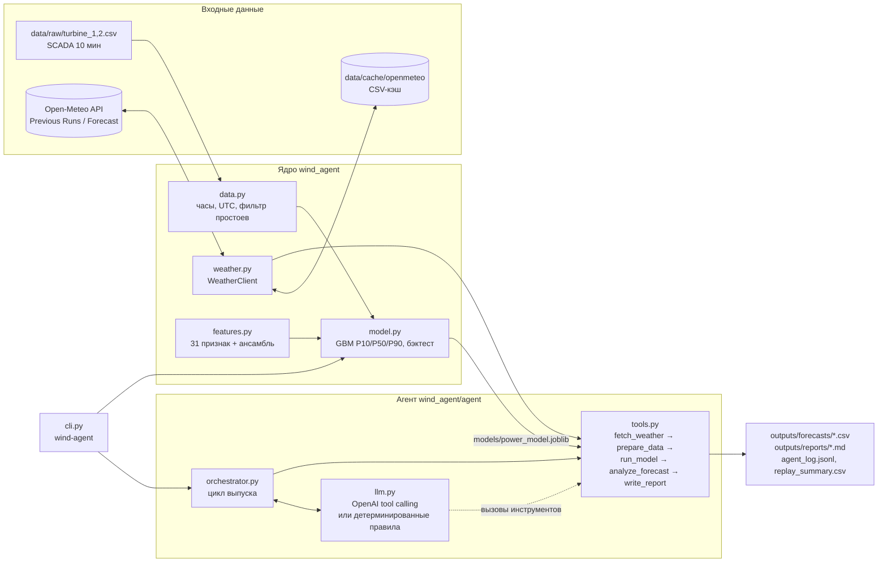
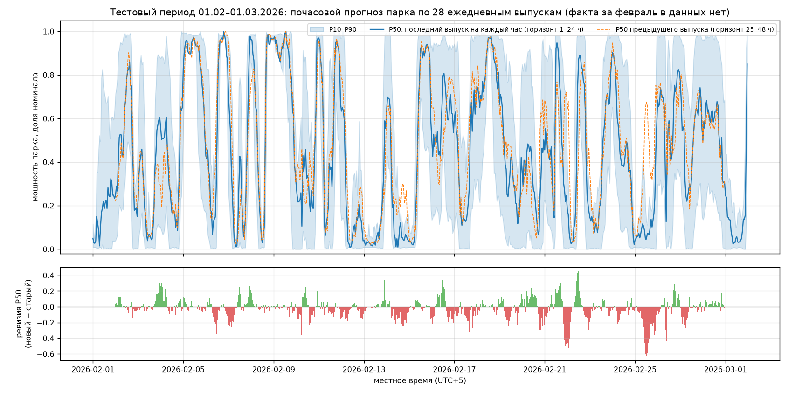
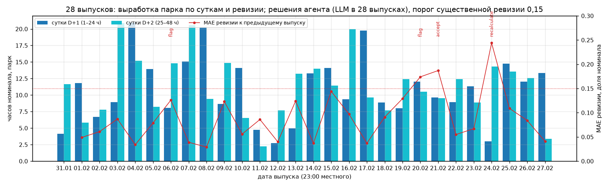
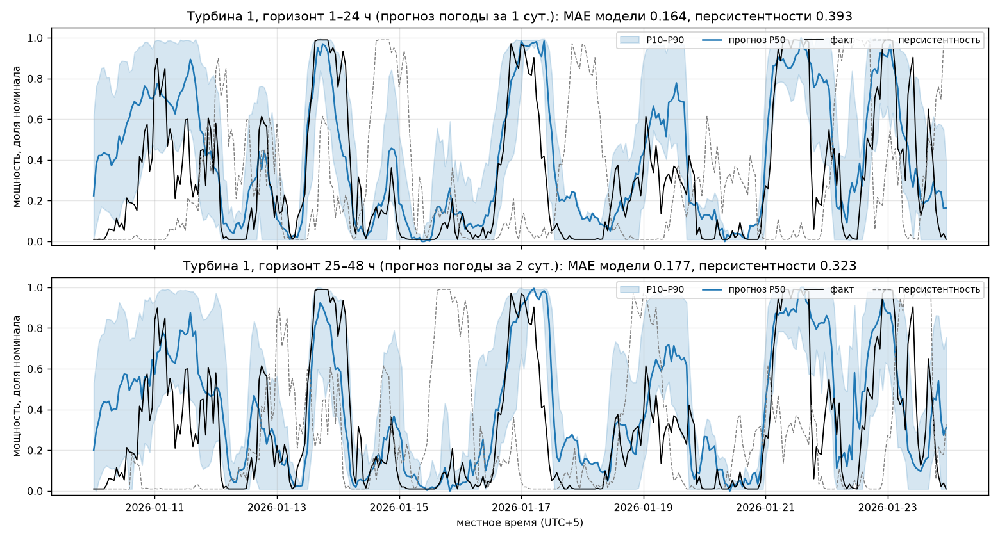
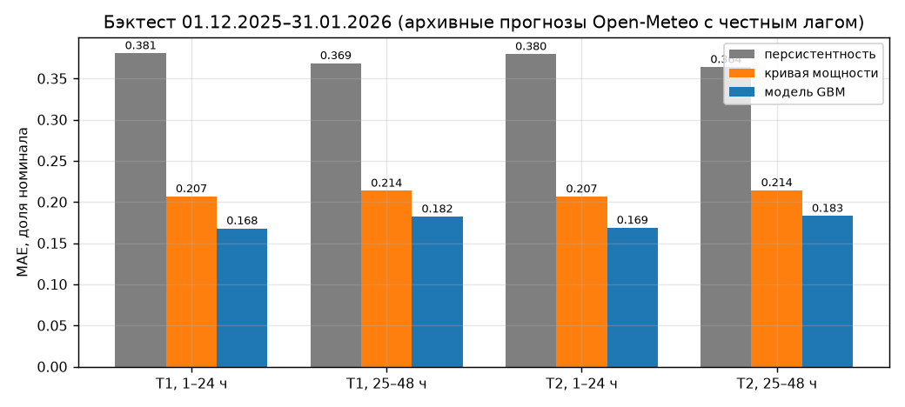
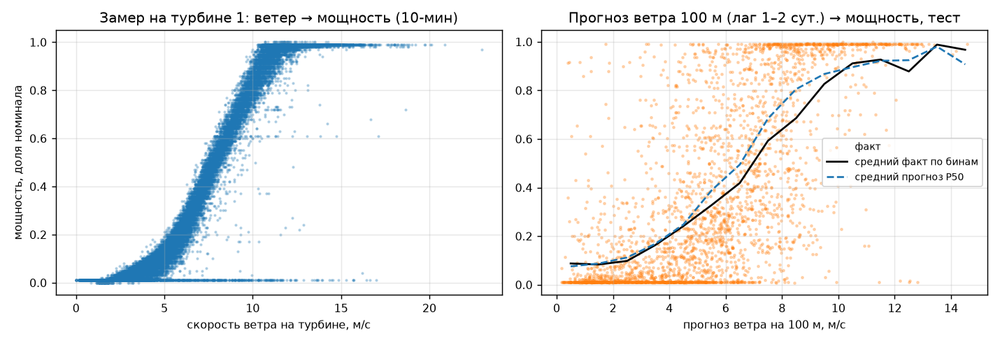

# WindAgent — агентный прогноз выработки ВЭС на 24–48 часов

HackAlem AI 2026, трек 01 «Энергетика», кейс Самрук-Казына «Agentic AI для прогнозирования выработки ВЭС». Команда PipeVision.

> **Коротко для жюри.** Ключи и аккаунты не нужны. Данные организаторов, кэш архивных прогнозов Open-Meteo и обученная модель лежат в репозитории, поэтому основной сценарий работает без сети:
> `make setup && make test && make replay-fast` (см. [раздел 8](#8-как-проверить-решение)).

---

## 1. Название

**WindAgent** (`wind-agent`) — агент, который каждый день сам берёт архивный прогноз погоды по координатам турбин, считает почасовой прогноз выработки ВЭС на 48 часов с интервалом неопределённости P10–P90, проверяет результат и пишет отчёт для диспетчера.

## 2. Краткое описание

Выработка ВЭС зависит от ветра, поэтому её нельзя планировать по вчерашнему профилю. Автокорреляция часовой мощности на лаге 24 ч всего 0,10, и персистентность ошибается на 37 % номинала (см. [`docs/01_analysis.md`](docs/01_analysis.md)). Диспетчеру и планировщику ВЭС нужен почасовой прогноз на сутки-двое вперёд: для графика выдачи мощности, планирования ремонтов и оценки рисков небаланса.

WindAgent решает задачу кейса. Для каждой даты выпуска тестового периода (31.01–27.02.2026) агент «живёт в прошлом»: берёт только тот прогноз погоды, который был доступен на момент выпуска, прогоняет его через модель «погода → мощность», обученную на истории 2024–2026 гг., анализирует результат и сохраняет прогноз и отчёт. Тот же цикл в режиме `live` работает с текущим прогнозом погоды.

## 3. Что реализовано

- **Подготовка данных SCADA** (`data.py`). 10-минутные замеры переводятся в часовые средние. Местное время датасета переводится в UTC: до 01.03.2024 это UTC+6, после — UTC+5. Из обучения исключаются простои и ограничения (ветер > 8 м/с при мощности < 0,02) и часы, где меньше 4 замеров.
- **Клиент Open-Meteo с дисковым кэшем и офлайн-режимом** (`weather.py`):
  - Previous Runs API — архив прогнозов с честным лагом `previous_day1` / `previous_day2`;
  - Forecast API — режим `live`;
  - Historical Forecast API — реализован, в текущем обучении не используется.
- **Ансамбль моделей погоды.** Кроме `best_match` агент запрашивает GFS (`gfs_seamless`), ICON (`icon_seamless`) и ECMWF IFS 0,25° (`ecmwf_ifs025`). Корреляция прогноза ветра на 100 м с замером: GFS 0,64, best_match 0,71, ECMWF 0,72, ICON 0,75, **среднее ансамбля 0,78**. Если какая-то модель недоступна, её признаки заполняются значениями best_match, и прогноз не падает.
- **Признаки** (`features.py`, 31 признак):
  - ветер на 10/80/100/120 м, порывы, ветер соседних часов, куб скорости;
  - сдвиг ветра, sin/cos направления, температура, давление, плотность воздуха;
  - гармоники часа и дня года, лаг прогноза, номер турбины;
  - ветер каждой модели ансамбля и среднее/разброс/минимум/максимум по ансамблю.
- **Вероятностная модель мощности** (`model.py`). Три `HistGradientBoostingRegressor` (scikit-learn): P50 (MSE) и квантили P10/P90. Выход обрезается до [0, 1], квантили не пересекаются. Одна модель обслуживает обе турбины (номер турбины — признак). Модель обучена на архивных прогнозах с тем же лагом, что и в тесте: каждый час истории входит дважды, с `lead_day = 1` и `lead_day = 2`.
- **Калибровка интервалов** (`PowerModel.calibrate`). Split-conformal поправка для квантильной регрессии (CQR) с нормировкой на ширину интервала, отдельно по горизонту: поправка оценивается на последних двух месяцах с фактом (дек.2025–янв.2026) моделью, которая их не видела, и применяется к финальной модели. На смежных месяцах (калибровка на декабре, проверка на январе) покрытие P10–P90 растёт с 73 % до 83 % при расширении интервала на 10 % ([`docs/01_analysis.md`](docs/01_analysis.md), раздел 9).
- **Честный бэктест** (`wind-agent backtest`). Протокол тот же: обучение до 30.11.2025, тест 01.12.2025–31.01.2026 (для этого периода есть факт). Сравнение с двумя бейзлайнами: кривой мощности и персистентностью. Метрики: MAE, RMSE, смещение, nMAE, покрытие P10–P90 ([раздел с метриками](#метрики-бэктеста)).
- **Финальная модель** (`wind-agent train`). Обучена на всей истории 16.02.2024–31.01.2026 (64 206 строк) и лежит в `models/power_model.joblib`, так что для прогона переобучать её не нужно.
- **Инструменты агента** (`agent/tools.py`): `fetch_weather → prepare_data → run_model → analyze_forecast → write_report`.
  - Прогноз P10/P50/P90 считается для `t1`, `t2` и парка `farm`.
  - Анализ проверяет диапазоны входа и выхода, считает энергию за 48 ч и по суткам, находит рампы, оценивает ширину интервала, сравнивает с климатической нормой месяца и с предыдущим выпуском (ревизия), ищет окна штиля для ТО.
  - Итог — решение `accept | recalculate | flag`.
- **LLM-слой** (`agent/llm.py`). OpenAI tool calling поверх тех же инструментов, ответы LLM валидируются. Без ключа или при ошибке вызова агент продолжает работу по детерминированным правилам и пишет отчёт по шаблону.
- **Проверка фактов в тексте LLM** (`tools.verify_narrative`). Каждое число из комментария агента сверяется с показателями анализа и прогноза (энергия, средние, доли, рампы, ревизия, климатология; допуск ±0,011 или ±3 %). Одно неподтверждённое число помечается в отчёте, два и больше — комментарий LLM отклоняется и заменяется шаблонным, а отклонённый текст сохраняется в отчёте для разбора. Обязательный пересчёт по правилам выполняется независимо от решения LLM, оба решения записываются.
- **Оркестратор** (`agent/orchestrator.py`):
  - `run_replay` выпускает прогноз на каждую дату: передаёт предыдущий выпуск для анализа ревизии, ведёт журнал и сводку, собирает последний прогноз на каждый целевой час;
  - `run_live` делает оперативный прогноз от текущего момента;
  - ошибка на одной дате не останавливает весь прогон.
- **CLI** `wind-agent backtest | train | replay | forecast | live`, флаги `--offline`, `--no-llm`, `-v`.
- **Графики бэктеста** (`scripts/make_figures.py` → `outputs/figures/`).
- **3D-визуализация рельефа и прогнозного поля ветра** ([`viz/README.md`](viz/README.md)):
  - `scripts/fetch_dem.py` — сетка высот ±6 км вокруг ВЭС с шагом 250 м → `data/terrain/`;
  - `scripts/build_viz_data.py` — рельеф, турбины, роза ветров и прогнозы из `outputs/forecasts/` → `viz/data/viz_data.js` и `viz/wind_rose.png`;
  - `scripts/fetch_osm_context.py` — раскладка парка (15 турбин ВЭС «Нурлы») и застройка из OpenStreetMap → `data/terrain/osm_context.json`;
  - страница `viz/index.html` (three.js с CDN) открывается по `file://` без сервера. На ней можно выбрать дату выпуска и пролистать 48 часов: ветер на 100 м, P10/P50/P90 парка, развороты роторов, все турбины парка (наши T1/T2 выделены), посёлок Нурлы и конус наветренной стороны с числом турбин парка в нём (при западном ветре — до 4 турбин перед T1, при восточном — сектор свободен);
  - это визуализация прогноза Open-Meteo в одной точке, а не CFD-расчёт обтекания рельефа.
- **Воспроизводимость:** `Makefile`, `Dockerfile`, `.env.example`, `requirements.lock`, 28 офлайн-тестов `pytest` (около минуты), включая сквозной прогон агента, проверку fallback при недоступной LLM, проверку фактов в тексте и прототип калибровки из исследования R2.

## 4. Как работает решение

### Протокол «как в прошлом»

Для каждой даты выпуска **D** с 31.01.2026 по 27.02.2026 (28 выпусков) агент ведёт себя так, будто сейчас **23:00 местного времени дня D** (18:00 UTC):

| Целевые часы | Горизонт | Откуда погода |
|---|---|---|
| сутки **D+1**, 00:00–23:00 местного | 1–24 ч | Open-Meteo Previous Runs, `*_previous_day1` — значение, спрогнозированное за 24 ч до целевого часа |
| сутки **D+2**, 00:00–23:00 местного | 25–48 ч | Open-Meteo Previous Runs, `*_previous_day2` — значение, спрогнозированное за 48 ч до целевого часа |

Используются **только архивные прогнозы** Open-Meteo. Фактическая погода и реанализ не используются нигде: ни в обучении, ни в тесте. Выпуск 31.01 даёт прогноз на 01–02.02, выпуск 27.02 закрывает 28.02 и 01.03. Каждый следующий выпуск пересчитывает общие часы по более свежему запуску модели погоды. Агент сравнивает новый прогноз с предыдущим (ревизия) и помечает существенные изменения.

### Сценарий от входных данных до результата

1. **Вход.** Дата выпуска (или текущий момент для `live`), координаты турбин из ТЗ, SCADA-история (для климатической нормы и бэктеста).
2. **`fetch_weather`.** Архивный прогноз на 48 ч для обеих турбин: best_match и три модели ансамбля. К нему прилагаются метаданные: источник, диапазон, пропуски, хэш входа, число обращений к API. Сначала читается кэш `data/cache/openmeteo`. С `--offline` агент в сеть не ходит вообще.
3. **`prepare_data`.** Проверка пропусков и физических диапазонов (скорость 0–60 м/с, температура −50…50 °C, давление 700–1100 гПа) и расчёт признаков.
4. **`run_model`.** P10/P50/P90 в долях номинала для `t1`, `t2` и `farm`.
5. **`analyze_forecast`.** Проверки и показатели:
   - значения в [0, 1] и P10 ≤ P50 ≤ P90;
   - энергия в «часах номинала» за 48 ч и по суткам;
   - рампы больше 0,4 номинала за час (`ramp`);
   - низкая уверенность: средняя ширина P90−P10 больше 0,6 (`low_confidence`);
   - отклонение от климатической нормы месяца по SCADA (`climatology`);
   - ревизия к прошлому выпуску на общих часах: MAE больше 0,15 (`revision`);
   - окна штиля от 6 ч с P50 ≤ 0,05 — кандидаты на окно для ТО (`calm_window`).
6. **Решение** (`accept | recalculate | flag`). Флаги бывают двух уровней: warning и info.
   - `recalculate` — есть warning о входе или результате (`input_quality`, `range_violation`, `quantile_order`, `incomplete`) либо существенная ревизия (`revision`). Агент повторно запрашивает погоду, пересчитывает прогноз и сравнивает хэш входа со старым;
   - `flag` — есть другие warning, например рампа (`ramp`). Прогноз принимается, диспетчер получает предупреждение;
   - `accept` — warning нет.

   Флаги уровня info (`low_confidence`, `climatology`, `calm_window`, `ensemble_gap`) попадают в отчёт, но на решение не влияют.

   В LLM-режиме инструменты вызывает модель OpenAI: она выбирает решение и пишет текст отчёта. Если LLM недоступна или не довела цикл до конца, оставшиеся шаги выполняются по правилам.
7. **`write_report`.** Результаты:
   - `outputs/forecasts/<issue_date>.csv` — почасовой прогноз;
   - `outputs/reports/<issue_date>.md` — отчёт для диспетчера: выработка по суткам, показатели, флаги, комментарий, ход работы агента, почасовая таблица;
   - `outputs/agent_log.jsonl` — журнал шагов агента: инструмент, кто вызвал (LLM или правила), статус, время, итог.

   После `replay` дополнительно:
   - `outputs/replay_summary.csv` — по строке на выпуск: энергия парка за 48 ч и по суткам, средний P50, MAE ревизии, флаги, статус, решение, использовалась ли LLM, число обращений к API;
   - `outputs/forecasts/latest_by_target.csv` — последний прогноз на каждый целевой час, прогноз предыдущего выпуска на тот же час (`previous_p50`) и ревизия (`revision`).

   Режим `live` пишет `outputs/live/<YYYYMMDDTHHMMZ>.csv` и `.md`. Оперативный прогноз не кэшируется, поэтому с `--offline` режим `live` отказывается работать и предлагает `replay`.

### Формат прогноза `outputs/forecasts/<issue_date>.csv`

На один выпуск приходится 144 строки: 48 ч × (`t1`, `t2`, `farm`). Порядок колонок фиксирован (`agent/tools.py`, `FORECAST_COLUMNS`):

| Колонка | Смысл |
|---|---|
| `issue_date`, `issue_time_utc` | дата выпуска D и момент выпуска (23:00 местного = 18:00 UTC) |
| `target_time_utc`, `target_time_local` | целевой час, ISO 8601 со смещением (`+00:00` / `+05:00`) |
| `lead_hours`, `lead_day` | горизонт 1–48 ч; 1 — сутки D+1, 2 — сутки D+2 |
| `turbine` | `t1`, `t2` или `farm` (среднее двух турбин) |
| `p10`, `p50`, `p90` | прогноз нормированной мощности, доля номинала [0, 1] |
| `wind_speed_100m`, `wind_direction_100m`, `wind_speed_10m`, `wind_gusts_10m`, `temperature_2m`, `surface_pressure` | прогноз погоды best_match (м/с, °, °C, гПа) |
| `weather_source`, `model_version` | источник погоды и версия модели (`power_model_v1@<конец обучения>`) |

## 5. Технологии

| Слой | Что используется |
|---|---|
| Язык | Python 3.11 (`requires-python >= 3.10`; зависимости последних версий — pandas 3, numpy 2.4 — требуют 3.11+) |
| Данные | pandas, numpy |
| ML | scikit-learn `HistGradientBoostingRegressor` (P50 + квантильная регрессия P10/P90), joblib |
| Погода | Open-Meteo: Previous Runs API, Forecast API, Historical Forecast API, Elevation API (рельеф для визуализации); модели best_match, GFS, ICON, ECMWF IFS 0,25°; `requests` |
| Agentic AI | собственный оркестратор с инструментами; OpenAI API (tool calling), модель по умолчанию `gpt-5-mini` (`OPENAI_MODEL`); детерминированный fallback |
| Отчёты и графики | Markdown, matplotlib; 3D-визуализация — HTML + three.js (WebGL) |
| Инфраструктура | `uv` или `venv` + `pip`, `Makefile`, Docker (`python:3.11-slim`), `pytest`, `python-dotenv` |

## 6. Архитектура



| Модуль | Назначение |
|---|---|
| `src/wind_agent/config.py` | координаты турбин, правила часового пояса, горизонт и даты теста, переменные погоды, модели ансамбля, пороги фильтра, пути |
| `src/wind_agent/weather.py` | `WeatherClient`: Previous Runs (`previous_runs`, `ensemble_previous_runs`), `archived_forecast` (срез «как в прошлом» на 48 ч), `live_forecast`, кэш и `offline` |
| `src/wind_agent/data.py` | `load_hourly` (SCADA → часы, UTC), `local_to_utc` / `utc_to_local`, `training_frame` (факт + прогноз с честным лагом) |
| `src/wind_agent/features.py` | `make_features`, список `FEATURES` (31 признак, из них 10 — ансамбль) |
| `src/wind_agent/model.py` | `PowerModel` (fit / predict / save / load), бейзлайны, `backtest`, `train_final` |
| `src/wind_agent/agent/tools.py` | инструменты агента, контракт CSV, проверки и отчёт |
| `src/wind_agent/agent/llm.py` | LLM-слой: системный промпт, tool calling (до 8 шагов на выпуск, таймаут 60 с), валидация, fallback |
| `src/wind_agent/agent/orchestrator.py` | `run_replay` (по датам выпуска, с передачей предыдущего выпуска), `run_live`; правила решения, журнал `agent_log.jsonl`, `replay_summary.csv`, `latest_by_target.csv` |
| `src/wind_agent/cli.py` | командная строка `wind-agent` |
| `scripts/make_figures.py`, `scripts/make_replay_figures.py` | графики бэктеста и прогона тестового периода → `outputs/figures/*.png` |
| `scripts/fetch_dem.py`, `scripts/build_viz_data.py`, `viz/` | рельеф (Copernicus DEM GLO-90 через Open-Meteo Elevation API) → `data/terrain/`; данные 3D-сцены → `viz/data/viz_data.js`, роза ветров → `viz/wind_rose.png` |
| `tests/` | 28 офлайн-тестов: часовой пояс, SCADA, архивный прогноз «как в прошлом», признаки, модель, сквозной прогон агента без LLM и со сбоем LLM (fallback на правила, те же числа), проверка фактов в нарративе, прототип калибровки (R2) |

### Агентный цикл

```
для каждой даты выпуска D (replay) или текущего момента (live):
  fetch_weather(D)       архивный прогноз на 48 ч (best_match + GFS/ICON/ECMWF), метаданные и хэш входа
  prepare_data           пропуски и диапазоны → признаки; проблемы входа → флаги
  run_model              P10/P50/P90 для t1, t2, farm
  analyze_forecast       энергия, рампы, уверенность, климатология, ревизия к выпуску D−1 → флаги
  решение                accept | recalculate (повторный запрос входа) | flag
                         (LLM через tool calling, без ключа — правила)
  write_report           outputs/forecasts/D.csv, outputs/reports/D.md, запись в agent_log.jsonl
```

LLM не считает прогноз и не меняет числа. Ей доступны только шесть инструментов: `fetch_weather`, `prepare_data`, `run_model`, `analyze_forecast`, `recalculate`, `write_report`. Числовых аргументов у них нет, `write_report` принимает только решение, обоснование и текст. Поэтому в `replay` почасовые P10/P50/P90 одинаковы в режимах с LLM и без неё, отличаются только решение и формулировка отчёта.

## 7. Установка и запуск

### Требования

- macOS или Linux (на Windows — WSL или Docker), Python **3.11+** (проверено на 3.11.15), около 300 МБ под виртуальное окружение.
- Интернет нужен только для установки зависимостей, режима `live`, повторной загрузки рельефа (`scripts/fetch_dem.py`) и библиотеки three.js на странице `viz/index.html`. Всё остальное работает на данных из репозитория.
- Аккаунты и ключи не нужны. `OPENAI_API_KEY` необязателен.

### Вариант А: uv (рекомендуется)

```bash
git clone https://github.com/BAITC-Hacks/hack-ce353db6-pipevision.git
cd hack-ce353db6-pipevision
uv venv --python 3.11          # создаёт .venv (uv сам скачает Python 3.11, если его нет)
uv pip install -e ".[dev]" -c requirements.lock   # проект + pytest, точные версии
source .venv/bin/activate
wind-agent --help
```

### Вариант Б: обычный venv + pip

```bash
git clone https://github.com/BAITC-Hacks/hack-ce353db6-pipevision.git
cd hack-ce353db6-pipevision
python3.11 -m venv .venv
source .venv/bin/activate
python -m pip install --upgrade pip
pip install -e ".[dev]" -c requirements.lock
wind-agent --help
```

> Рекомендуем режим `-e` (editable): тогда `config.ROOT` — папка репозитория. При обычном `pip install .` пакет попадает в `site-packages`, и корень проекта берётся из текущей папки (команды нужно запускать из корня репозитория) либо из переменной `WIND_AGENT_ROOT`.
>
> `-c requirements.lock` фиксирует точные версии библиотек, на которых обучена модель и проходят тесты. Без него установятся последние версии из `pyproject.toml`: это тоже работает, но без гарантии побитового совпадения.

### Вариант В: Makefile

```bash
make setup        # uv, если установлен, иначе python3.11+ -m venv + pip; создаёт .venv, ставит версии из requirements.lock
make help         # список целей
```

| Цель | Команда |
|---|---|
| `make test` | `pytest -q` (офлайн, меньше минуты) |
| `make replay-fast` | `wind-agent --offline replay --no-llm --start 2026-01-31 --end 2026-02-02` (около 2 с) |
| `make replay` | `wind-agent replay --start 2026-01-31 --end 2026-02-27` |
| `make forecast DATE=2026-02-10` | `wind-agent forecast --issue-date 2026-02-10` |
| `make backtest` / `make train` | `wind-agent backtest` / `wind-agent train` |
| `make live` | `wind-agent live` |
| `make viz` | `scripts/fetch_dem.py` (рельеф; если `data/terrain/` уже есть, ничего не качает) и `scripts/build_viz_data.py` (→ `viz/data/viz_data.js`); затем откройте `viz/index.html` в браузере |
| `make docker`, `make docker-replay` | сборка образа и офлайн-прогон в контейнере |
| `make clean` | удаляет кэши Python и pytest; результаты, модель и кэш погоды не трогает |
| `make clean-outputs` | удаляет результаты прогонов агента (`outputs/forecasts`, `reports`, `live`, журнал, сводку); они восстанавливаются через `make replay` |

### Вариант Г: Docker

```bash
docker build -t wind-agent .
docker run --rm -v "$PWD/outputs:/app/outputs" wind-agent replay --no-llm --offline
# с LLM: docker run --rm --env-file .env -v "$PWD/outputs:/app/outputs" wind-agent replay
```

### Команды

Флаги `--offline` (без сети, только кэш) и `-v` (подробный лог) можно ставить и до, и после подкоманды: `wind-agent --offline replay …` и `wind-agent replay --offline …` работают одинаково.

```bash
wind-agent backtest                     # ≈0,5–1 мин: бэктест дек.2025–янв.2026 → outputs/backtest_metrics.json, backtest_predictions.csv
wind-agent train                        # ≈0,5–1 мин: финальная модель → models/power_model.joblib (уже лежит в репозитории)
wind-agent replay --no-llm --offline --start 2026-01-31 --end 2026-02-02   # 3 выпуска без сети и LLM, ≈2 с
wind-agent replay --no-llm --offline    # все 28 выпусков 31.01–27.02.2026, ≈7 с
wind-agent replay                       # то же с LLM, если в .env задан OPENAI_API_KEY (иначе автоматически без LLM)
wind-agent forecast --issue-date 2026-02-10 --no-llm   # один выпуск
wind-agent live                         # оперативный прогноз по текущему запуску Open-Meteo (нужна сеть) → outputs/live/
python scripts/make_figures.py          # графики бэктеста → outputs/figures/
```

### Переменные окружения

Все переменные необязательны. Скопируйте шаблон: `cp .env.example .env`. `cli.py` сам загружает `.env` из корня репозитория, а `.env` в git не попадает.

| Переменная | По умолчанию | Назначение |
|---|---|---|
| `OPENAI_API_KEY` | пусто | включает LLM-режим агента; без ключа агент работает детерминированно |
| `OPENAI_MODEL` | `gpt-5-mini` | модель OpenAI для агента |
| `OPENAI_BASE_URL` | `https://api.openai.com/v1` | OpenAI-совместимый endpoint (читается OpenAI SDK) |
| `OPENAI_REASONING_EFFORT` | `low` | уровень рассуждений для reasoning-моделей (`gpt-5*`, `o*`) |
| `WIND_AGENT_ROOT` | папка репозитория | корень проекта с `data/`, `models/`, `outputs/` (нужен только при установке без `-e` и запуске не из корня) |

## 8. Как проверить решение

Сценарий для жюри, около 5 минут:

```bash
# 1. клон и установка (1–2 мин)
git clone https://github.com/BAITC-Hacks/hack-ce353db6-pipevision.git && cd hack-ce353db6-pipevision
uv venv --python 3.11 && uv pip install -e ".[dev]" -c requirements.lock && source .venv/bin/activate
#    без uv: python3.11 -m venv .venv && source .venv/bin/activate && pip install -e ".[dev]" -c requirements.lock

# 2. тесты (офлайн, меньше минуты; первый запуск дольше — Python компилирует библиотеки)
pytest -q

# 3. агент на трёх датах выпуска: без сети, без LLM (≈2 с)
wind-agent replay --no-llm --offline --start 2026-01-31 --end 2026-02-02
```

В логе будет строка на каждый выпуск:

```
2026-01-31 | парк  15.5 ч.н. за 48 ч (D+1  4.0, D+2 11.5) | P50 ср. 0.32 | ревизия MAE —     | ok | accept | LLM нет | без флагов
2026-02-01 | парк  17.1 ч.н. за 48 ч (D+1 11.8, D+2  5.3) | P50 ср. 0.36 | ревизия MAE 0.047 | ok | accept | LLM нет | без флагов
2026-02-02 | парк  14.1 ч.н. за 48 ч (D+1  6.4, D+2  7.7) | P50 ср. 0.29 | ревизия MAE 0.061 | ok | accept | LLM нет | без флагов
```

Что смотреть после шага 3:

- `outputs/forecasts/2026-01-31.csv` (и `2026-02-01.csv`, `2026-02-02.csv`) — 144 строки: почасовой P10/P50/P90 на 01–02.02.2026 для `t1`, `t2`, `farm`, горизонт 1–48 ч ([формат](#формат-прогноза-outputsforecastsissue_datecsv));
- `outputs/reports/2026-01-31.md` — отчёт агента: выработка по суткам с интервалом, средняя мощность, отклонение от климатической нормы, рампы, ширина интервала, ревизия, флаги, решение и обоснование, таблица шагов агента, почасовой прогноз парка;
- `outputs/agent_log.jsonl` — по записи на каждый шаг: инструмент, кто вызвал, статус, время, итог;
- `outputs/replay_summary.csv` — по строке на выпуск; `outputs/forecasts/latest_by_target.csv` — последний прогноз на каждый час и его ревизия.

Дальше:

```bash
# 4. полный прогон тестового периода: 28 выпусков 31.01–27.02.2026 (≈7 с)
wind-agent replay --no-llm --offline
#    с LLM: cp .env.example .env, вписать OPENAI_API_KEY, затем wind-agent replay

# 5. честный бэктест с эталоном (≈0,5–1 мин, random_state=42)
wind-agent backtest
# ожидаемый вывод (MAE в долях номинала):
# {"model": 0.1754..., "power_curve": 0.2103..., "persistence": 0.3732...}
```

Итог шага 4 в режиме `--no-llm`, решения по правилам (проверено в чистом клоне): 28 выпусков без ошибок, в среднем 22,2 часа номинала на парк за 48 ч.
- 24 выпуска приняты (`accept`).
- 1 выпуск — `flag`: 09.02, рампа.
- 3 выпуска — `recalculate`: 20.02, 21.02 и 24.02, существенная ревизия к предыдущему выпуску (MAE 0,17–0,24).

**Что лежит в `outputs/`.** В репозитории — результаты полного прогона с LLM (`gpt-5-mini`, tool calling): все 28 выпусков прошли LLM-циклом, в журнале 143 обращения к LLM, модель с калибровкой интервалов.
- Почасовые P10/P50/P90 в `outputs/forecasts/` побитово совпадают с результатом `wind-agent replay --no-llm --offline` (проверено `git diff`).
- Решения LLM: 25 `accept`, 2 `flag` (09.02, 20.02), 1 `recalculate` (21.02). Проверка фактов: 369 чисел в 28 комментариях LLM, все подтверждены анализом (две ложные тревоги на номерах дат устранены в правилах разбора).
- На всех трёх существенных ревизиях (20.02, 21.02, 24.02) агент выполнил `recalculate`. Повторный запрос показал, что вход не изменился, и прогноз подтверждён.
- После `replay` у себя вы увидите изменения в `outputs/` (журнал, отчёты, сводка). Это ожидаемо: отчёты перезаписываются в выбранном режиме.

Как выглядит результат прогона (`python scripts/make_replay_figures.py`): сшитый прогноз парка на весь февраль — на каждый час последний выпуск (горизонт 1–24 ч) с интервалом P10–P90 и прогноз предыдущего выпуска на тот же час (горизонт 25–48 ч); внизу — ревизия между ними.





**Воспроизводимость проверена.** На macOS (arm64) результаты из чистого клона побитово совпадают с закоммиченными. Для бэктеста `git diff` пуст. В `replay` все 4032 значения P10/P50/P90 за 28 выпусков совпадают с `outputs/forecasts/`.

В Docker (Linux) возможны незначительные расхождения:
- в бэктесте MAE модели 0,1751 вместо 0,1754;
- в `replay` около 3 % значений отличаются не больше чем на 0,023 номинала;
- решения агента и флаги те же, энергия парка за 48 ч отличается не больше чем на 0,03 часа номинала.

Причина — последние биты `sin`/`cos` в numpy на разных платформах: изредка они переводят значение признака по другую сторону порога дерева. Бейзлайны совпадают точно.

### Метрики бэктеста

Протокол тот же, что в тесте: выпуск в 23:00 дня D, часы D+1 по `previous_day1`, часы D+2 по `previous_day2`.
- Обучение: 16.02.2024–30.11.2025, 58 322 строки.
- Тест: 01.12.2025–31.01.2026, для этого периода есть факт.
- Мощность нормирована на номинал, поэтому MAE × 100 = nMAE в % номинала.
- Источник чисел: `outputs/backtest_metrics.json`.

| Турбина | Горизонт | Часов | **Модель P50, MAE** | Модель, RMSE | Кривая мощности, MAE | Персистентность, MAE | Покрытие P10–P90 (без калибровки → с калибровкой окт–ноя) |
|---|---|---|---|---|---|---|---|
| T1 | 1–24 ч (`previous_day1`) | 1479 | **0,168** | 0,231 | 0,207 | 0,381 | 73,4 % → 74,5 % |
| T1 | 25–48 ч (`previous_day2`) | 1479 | **0,182** | 0,249 | 0,214 | 0,369 | 72,9 % → 74,3 % |
| T2 | 1–24 ч (`previous_day1`) | 1463 | **0,169** | 0,232 | 0,207 | 0,380 | 70,2 % → 73,1 % |
| T2 | 25–48 ч (`previous_day2`) | 1463 | **0,183** | 0,250 | 0,214 | 0,364 | 69,5 % → 72,4 % |
| **Все** | 1–48 ч | 5884 | **0,175** (nMAE 17,5 %) | 0,241 | 0,210 | 0,373 | — |

- MAE модели на 17 % ниже, чем у кривой мощности по прогнозному ветру, и в 2,1 раза ниже, чем у персистентности.
- Средняя фактическая мощность в тесте — 0,38 (T1) и 0,37 (T2).
- Смещение модели в тесте +0,044: небольшая переоценка.
- Бейзлайны:
  - кривая мощности — средняя мощность в бинах 0,5 м/с по прогнозному ветру на 100 м;
  - персистентность — мощность в тот же час дня выпуска D.







Графики пересобираются командой `python scripts/make_figures.py` после `wind-agent backtest`.

## 9. Данные и интеграции

**Датасет организаторов:** `data/raw/turbine_1.csv`, `data/raw/turbine_2.csv`.
- Шаг 10 мин, период с 11.03.2023 00:00 по 31.01.2026 23:50: 142 360 и 149 499 строк.
- Колонки: время, средняя скорость ветра (м/с), нормированная активная мощность, температура (°C).
- Часовой пояс меток в файлах не указан. Кросс-корреляция с Open-Meteo показала, что это местное время: **UTC+6 до 01.03.2024 и UTC+5 после** (с 1 марта 2024 года Казахстан живёт по единому времени UTC+5). Внутри системы всё хранится в UTC, вывод идёт в местном времени UTC+5.
- В названии файлов указан период до 28.02.2026, но фактические данные заканчиваются 31.01.2026.

**Координаты турбин** (из ТЗ): T1 — 43.645150, 78.535604; T2 — 43.643198, 78.538828. Расстояние между турбинами около 340 м, Енбекшиказахский район Алматинской области. Open-Meteo привязывает обе турбины к узлу сетки 43.620, 78.479 (555 м).

**Open-Meteo** — бесплатно, без ключа и регистрации, данные по лицензии CC BY 4.0:

| API | Endpoint | Где используется |
|---|---|---|
| Previous Runs API | `previous-runs-api.open-meteo.com/v1/forecast` | архивные прогнозы `*_previous_day1/2` для обучения, бэктеста и `replay`; best_match и модели `gfs_seamless`, `icon_seamless`, `ecmwf_ifs025`. Архив для нашей точки — с 16.02.2024 |
| Forecast API | `api.open-meteo.com/v1/forecast` | режим `live` (без кэша) |
| Historical Forecast API | `historical-forecast-api.open-meteo.com/v1/forecast` | реализован в `weather.py`, в текущем пайплайне не используется |
| Elevation API | `api.open-meteo.com/v1/elevation` | рельеф для 3D-визуализации (`scripts/fetch_dem.py`) |

**OpenStreetMap** (Overpass API, `scripts/fetch_osm_context.py` → `data/terrain/osm_context.json`): раскладка ВЭС «Нурлы» (15 турбин в радиусе 5 км, из них наши T1/T2 — Goldwind GW109/2500, 2,5 МВт; остальные 13 — к западу и северо-западу в пределах 1,2 км) и полигоны застройки для 3D-сцены и индикатора «турбины парка с наветренной стороны». Полигонов леса в OSM для этой территории нет. Только для визуализации, в модели не используется.

**Кэш:** `data/cache/openmeteo/<тип>__<турбина>__<начало>__<конец>.csv`.
- В репозитории лежат архивы 16.02.2024–31.01.2026 (обучение) и 30.01–02.03.2026 (тестовый период) для обеих турбин и всех четырёх моделей погоды.
- Клиент сначала ищет файл, покрывающий запрошенный диапазон, и только при промахе идёт в API; ответ он сохраняет в кэш.
- С `--offline` сеть запрещена: если кэша нет, будет ошибка, тихой подмены данных нет.

**OpenAI API** (необязательно): LLM-режим агента, ключ `OPENAI_API_KEY`. Без ключа всё работает детерминированно.

## 10. Ограничения

- **Нет факта за февраль 2026.** В датасете нет данных после 31.01.2026, поэтому точность прогнозов тестового февраля посчитать нельзя. Метрики с эталоном приведены по бэктесту на дек.2025–янв.2026 по тому же протоколу. Для февраля агент оценивает качество косвенно: ревизии, климатология, согласие моделей ансамбля.
- **Одна точка сетки моделей погоды** (около 11 км, узел примерно в 5 км от турбин). Рельеф и ветровой коридор площадки явно не моделируются. Замер на турбинах систематически выше прогноза ветра на 100 м (≈1,2 раза). Это смещение модель выучивает из данных.
- **Одинаковая погода для обеих турбин.** Турбины попадают в один узел сетки, поэтому входной прогноз погоды для них одинаков: файлы кэша `t1` и `t2` совпадают побайтно. Различия в прогнозе турбин даёт только признак `turbine_id`.
- **Смысл `previous_dayN` в Open-Meteo.** Это значение, спрогнозированное за N×24 ч до целевого часа. Для последних часов суток D+1 и D+2 запуск инициализирован почти в момент выпуска (23:00 местного дня D). С учётом задержки публикации запусков (несколько часов) часть таких часов могла опираться на запуск, который в 23:00 ещё не был опубликован. Более строгий вариант — брать один конкретный запуск на все 48 ч.
- **Интервал P10–P90 зависит от сезона.** Без калибровки покрытие 70–73 % при номинальных 80 %; конформная поправка, оценённая на дек.2025–янв.2026, в бэктесте (калибровка на окт–ноя) даёт лишь 73,6 %, а на смежных зимних месяцах — 83 %. Для февраля применяется зимняя поправка; в эксплуатации её нужно пересчитывать по скользящему окну.
- **Простои и ограничения мощности не прогнозируются.** Такие часы исключены из обучения, поэтому модель прогнозирует выработку исправной турбины без ограничений. Данных о плановых ремонтах и диспетчерских ограничениях нет.
- **Парк `farm`** — среднее квантилей двух турбин, а не квантиль суммы. Это близко к истине, потому что корреляция мощности турбин 0,97. Мощность нормирована: номинал в МВт в данных не указан, поэтому энергия считается в «часах номинала».
- **История 2023 года не используется в обучении.** Архив прогнозов с лагом у Open-Meteo начинается с 16.02.2024.
- **Лицензия Open-Meteo.** Бесплатный доступ Open-Meteo предназначен для некоммерческого использования (до 10 000 запросов в сутки). Для промышленной эксплуатации нужен коммерческий тариф или собственный источник NWP.
- **Версия scikit-learn.** Модель сохранена в `joblib` с scikit-learn 1.9.1. Точные версии всех зависимостей зафиксированы в `requirements.lock`, и команды установки выше используют его как constraints. Если модель всё же не загружается из-за другой версии библиотеки, выполните `wind-agent train` (≈0,5–1 мин).
- **LLM-режим требует ключа OpenAI и сети**, его ответы недетерминированы. Проверка жюри рассчитана на режим `--no-llm`, в нём прогнозные значения те же.
- **Интерфейс.** Веб-сервиса нет: CLI, CSV и Markdown-отчёты, графики и статическая 3D-страница `viz/index.html`. На этой странице поле ветра одинаково по всему квадрату 12 × 12 км: обтекание рельефа не моделируется.

## 11. Ссылка на deployed-версию

Нет. Решение запускается локально (CLI) или в Docker ([раздел 7](#вариант-г-docker)).

## 12. Потенциал развития

Что показали данные и что из этого следует ([`docs/01_analysis.md`](docs/01_analysis.md), разделы 7–8):

- **Направление ветра решает.** Ветер на площадке бимодальный (ВСВ/В — 44 % часов, ЗЮЗ/З — 42 %). С востока замер на турбинах в 1,23–1,26 раза выше прогноза Open-Meteo, с запада — 0,91–0,98; при одинаковом прогнозе 7–9 м/с выработка с востока 0,67–0,73, с запада 0,44–0,51. По спутниковому снимку наши две турбины стоят на юго-восточном краю ВЭС «Нурлы», к западу — посёлок, к северо-востоку — лес: с запада турбины работают в следе остальных турбин парка. Модель учитывает это через признаки направления (смещение по секторам на тесте ±0,06), но явные признаки — число турбин парка с наветренной стороны, шероховатость (лес/застройка) по секторам, экспозиция рельефа — могут снять остаток ошибки. Раскладку парка и полигоны леса/посёлка можно взять из OpenStreetMap, рельеф уже есть в `data/terrain/`.
- **Прогноз всего парка.** В датасете две турбины; та же модель с признаком турбины и раскладкой парка масштабируется на всю ВЭС «Нурлы» и на другие площадки Самрук-Энерго — нужна только их SCADA-история.
- **Калибровка интервалов.** Покрытие P10–P90 сейчас 70–73 % при номинале 80 %; конформная калибровка по горизонту даст честные интервалы для оценки рисков небаланса.
- **Сервис для диспетчера.** Режим `live` уже даёт оперативный прогноз по последнему запуску Open-Meteo; следующий шаг — планировщик (каждые 6 ч по выходу новых запусков NWP), REST API/веб-панель на базе `viz/`, уведомления о существенных ревизиях и окнах штиля для ТО.
- **Дообучение по факту.** Ежедневное добавление факта SCADA и переобучение по расписанию; контроль дрейфа по ошибке за последние 30 дней.
- **Источники погоды.** Коммерческий тариф Open-Meteo или прямые NWP-данные (ECMWF, ICON) с большим числом запусков в сутки и ансамблевыми членами (ENS) для честной неопределённости.
- **Простои и ограничения.** Учёт графика ремонтов и диспетчерских ограничений превратит прогноз «исправной турбины» в прогноз фактической выдачи.

---

## Структура репозитория

```
├── README.md, pyproject.toml, requirements.lock, Makefile, Dockerfile, .env.example
├── data/raw/turbine_{1,2}.csv        # датасет организаторов
├── data/cache/openmeteo/*.csv        # кэш архивных прогнозов Open-Meteo (офлайн-воспроизводимость)
├── data/terrain/                     # сетка высот рельефа для 3D-визуализации
├── models/power_model.joblib         # финальная модель (P10/P50/P90)
├── src/wind_agent/                   # config, weather, data, features, model, cli
│   └── agent/                        # tools, llm, orchestrator
├── outputs/                          # backtest_*, figures/, forecasts/, reports/, live/, agent_log.jsonl, replay_summary.csv
├── scripts/                          # make_figures.py, fetch_dem.py, build_viz_data.py
├── viz/                              # index.html (three.js), data/viz_data.js, wind_rose.png, README.md
├── tests/                            # pytest, офлайн
└── docs/                             # ТЗ, положение, анализ данных (01_analysis.md), план (02_plan.md), research/ — исследования (R2: калибровка)
```

## Раскрытие сторонних компонентов

По п. 5.4.4 Положения ниже перечислено всё стороннее, что использует проект.

| Компонент | Для чего | Лицензия |
|---|---|---|
| pandas, numpy | обработка данных | BSD-3-Clause |
| scikit-learn | `HistGradientBoostingRegressor` (P50, квантили) | BSD-3-Clause |
| joblib | сохранение модели | BSD-3-Clause |
| requests | HTTP-клиент Open-Meteo | Apache-2.0 |
| python-dotenv | чтение `.env` | BSD-3-Clause |
| openai (Python SDK) | LLM-режим агента | Apache-2.0 |
| matplotlib | графики | Matplotlib License (PSF-подобная) |
| pytest | тесты | MIT |
| Open-Meteo API | архивные и оперативные прогнозы погоды (модели NOAA GFS, DWD ICON, ECMWF IFS), рельеф | данные CC BY 4.0, «Weather data by Open-Meteo.com» |
| Copernicus DEM GLO-90 (через Open-Meteo Elevation API) | высоты рельефа для визуализации (`data/terrain/`) | © DLR e.V., © Airbus Defence and Space GmbH; предоставлено по программе Copernicus (ЕС, ESA) |
| three.js 0.160 (CDN cdn.jsdelivr.net) | 3D-сцена `viz/index.html`, OrbitControls | MIT |
| OpenStreetMap (Overpass API) | раскладка турбин парка и застройка для 3D-сцены (`data/terrain/osm_context.json`) | ODbL 1.0, © участники OpenStreetMap |
| OpenAI API | LLM-агент (необязательно) | условия OpenAI |
| Датасет организаторов | SCADA турбин 1 и 2 | материалы кейса |

Модели машинного обучения, код решения, признаки, агентный цикл, проверки и отчёты написаны командой во время соревновательной части хакатона 23.09.2026. Готовых решений и предобученных моделей мощности не использовалось. Разработка велась с AI-ассистентом Claude Code (разрешено п. 5.4.12 Положения), история видна в коммитах.
