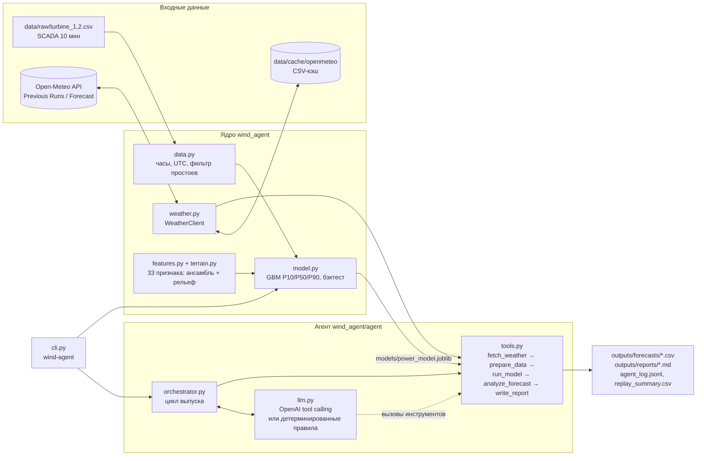
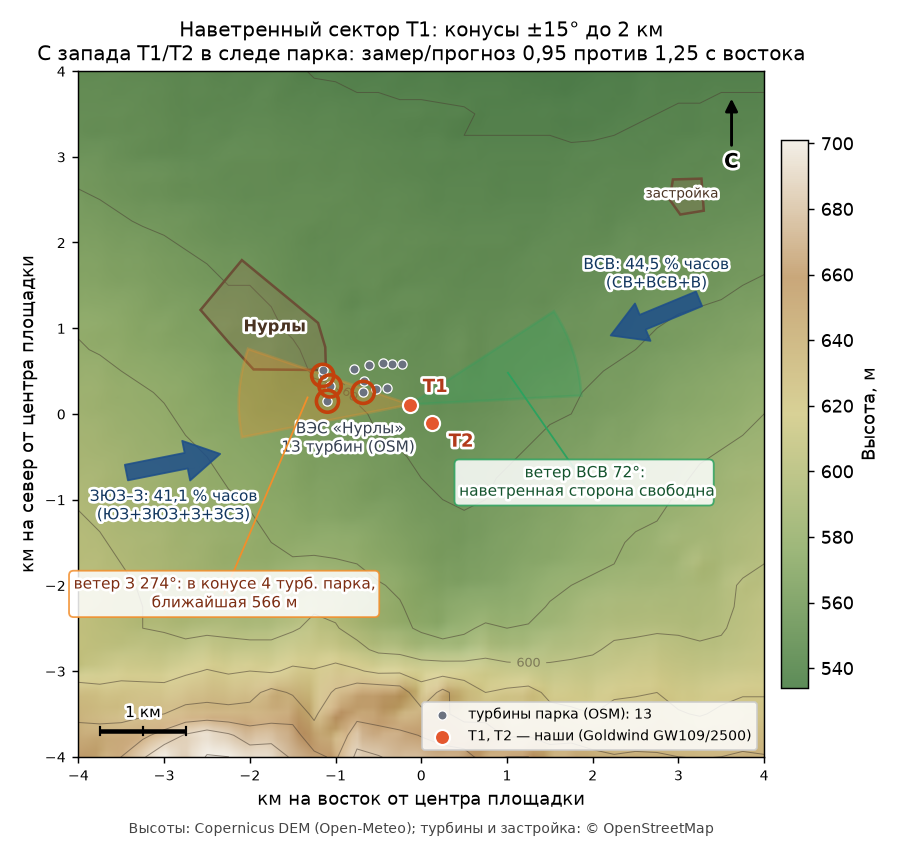

# WindAgent — агентный прогноз выработки ВЭС на 24–48 часов

HackAlem AI 2026, трек 01 «Энергетика», кейс Самрук-Казына «Agentic AI для прогнозирования выработки ВЭС». Команда PipeVision.

> **Коротко для жюри.** Для расчёта API-ключи не нужны. Сначала получите доступ к репозиторию и установите зависимости через интернет; затем тесты и `replay --no-llm --offline` работают на сохранённых данных без сети:
> `make setup && make test && make replay-fast` (см. [раздел 8](#8-как-проверить-решение)).

---

## 1. Название

**WindAgent** (`wind-agent`) — агент, который каждый день сам берёт архивный прогноз погоды по координатам турбин, считает почасовой прогноз выработки ВЭС на 48 часов с интервалом неопределённости P10–P90, проверяет результат и пишет отчёт для диспетчера.

## 2. Краткое описание

Выработка ВЭС зависит от ветра, поэтому её нельзя планировать по вчерашнему профилю. Автокорреляция часовой мощности на лаге 24 ч всего 0,10, и персистентность ошибается на 37 % номинала (см. [`docs/01_analysis.md`](docs/01_analysis.md)). Диспетчеру и планировщику ВЭС нужен почасовой прогноз на сутки-двое вперёд: для графика выдачи мощности, планирования ремонтов и оценки рисков небаланса.

WindAgent решает задачу кейса. Для каждой даты выпуска тестового периода (31.01–27.02.2026) агент «живёт в прошлом»: берёт только тот прогноз погоды, который был доступен на момент выпуска, прогоняет его через модель «погода → мощность», обученную на истории 2024–2026 гг., анализирует результат и сохраняет прогноз и отчёт. Тот же цикл в режиме `live` работает с текущим прогнозом погоды.

Та же модель и тот же агент работают для любой точки Казахстана. Панель оператора открывается на ВЭС «Нурлы», а на карте страны показывает атлас ветра: специалист выбирает перспективную ячейку, уточняет координаты и запускает исследование площадки — год реанализа ERA5, распределение Вейбулла, КИУМ и годовая выработка по эмпирической кривой мощности «Нурлы», рельеф и 3D-сцена точки, прогноз на 48 ч и отчёт для руководства.

## 3. Что реализовано

- **Подготовка данных SCADA** (`data.py`). 10-минутные замеры переводятся в часовые средние. Местное время датасета переводится в UTC: до 01.03.2024 это UTC+6, после — UTC+5. Из обучения исключаются простои и ограничения (ветер > 8 м/с при мощности < 0,02) и часы, где меньше 4 замеров.
- **Клиент Open-Meteo с дисковым кэшем и офлайн-режимом** (`weather.py`):
  - Previous Runs API — архив прогнозов с честным лагом `previous_day1` / `previous_day2`;
  - Forecast API — режим `live`;
  - Historical Forecast API — реализован, в текущем обучении не используется.
- **Ансамбль моделей погоды.** Кроме `best_match` агент запрашивает GFS (`gfs_seamless`), ICON (`icon_seamless`) и ECMWF IFS 0,25° (`ecmwf_ifs025`). Корреляция прогноза ветра на 100 м с замером: GFS 0,64, best_match 0,71, ECMWF 0,72, ICON 0,75, **среднее ансамбля 0,78**. Если какая-то модель недоступна, её признаки заполняются значениями best_match, и прогноз не падает.
- **Признаки** (`features.py`, 33 признака):
  - ветер на 10/80/100/120 м, порывы, ветер соседних часов, куб скорости;
  - сдвиг ветра, sin/cos направления, температура, давление, плотность воздуха;
  - гармоники часа и дня года, лаг прогноза, номер турбины;
  - ветер каждой модели ансамбля и среднее/разброс/минимум/максимум по ансамблю;
  - два признака рельефа по направлению ветра (уклон с наветренной стороны и локальный уклон по DEM; исследование R1 — `terrain.py`, [`docs/research/R1_terrain.md`](docs/research/R1_terrain.md)): MAE бэктеста 0,175 → 0,171.
- **Вероятностная модель мощности** (`model.py`). Три `HistGradientBoostingRegressor` (scikit-learn): P50 (MSE) и квантили P10/P90. Выход обрезается до [0, 1], квантили не пересекаются. Одна модель обслуживает обе турбины (номер турбины — признак). Модель обучена на архивных прогнозах с тем же лагом, что и в тесте: каждый час истории входит дважды, с `lead_day = 1` и `lead_day = 2`.
- **Калибровка интервалов** (`PowerModel.calibrate`). Split-conformal поправка для квантильной регрессии (CQR) с нормировкой на ширину интервала, отдельно по горизонту: поправка оценивается на последних двух месяцах с фактом (дек.2025–янв.2026) моделью, которая их не видела, и применяется к финальной модели. На смежных месяцах (калибровка на декабре, проверка на январе) покрытие P10–P90 растёт с 73 % до 83 % при расширении интервала на 10 % ([`docs/01_analysis.md`](docs/01_analysis.md), раздел 9).
- **Честный бэктест** (`wind-agent backtest`). Протокол тот же: обучение до 30.11.2025, тест 01.12.2025–31.01.2026 (для этого периода есть факт). Сравнение с двумя бейзлайнами: кривой мощности и персистентностью. Метрики: MAE, RMSE, смещение, nMAE, покрытие P10–P90 ([раздел с метриками](#метрики-бэктеста)).
- **Финальная модель** (`wind-agent train`). Обучена на всей истории 16.02.2024–31.01.2026 (64 206 строк) и лежит в `models/power_model.joblib`, так что для прогона переобучать её не нужно.
- **Инструменты агента** (`agent/tools.py`): `fetch_weather → prepare_data → run_model → analyze_forecast → write_report`.
  - Прогноз P10/P50/P90 считается для `t1`, `t2` и парка `farm`.
  - Анализ проверяет диапазоны входа и выхода, считает энергию за 48 ч и по суткам, находит рампы, оценивает ширину интервала, сравнивает с климатической нормой месяца и с предыдущим выпуском (ревизия), ищет окна штиля для ТО.
  - Итог — решение `accept | recalculate | flag`.
- **LLM-слой** (`agent/llm.py`). OpenAI tool calling поверх тех же инструментов, ответы LLM валидируются. Без ключа или при ошибке вызова агент продолжает работу по детерминированным правилам и пишет отчёт по шаблону.
- **Проверка фактов в тексте LLM** (`tools.verify_narrative`). Каждое число из комментария агента сверяется с показателями анализа и прогноза (энергия, средние, доли, рампы, ревизия, климатология; допуск ±0,011 или ±3 %). Одно неподтверждённое число помечается в отчёте, два и больше — комментарий LLM отклоняется и заменяется шаблонным, а отклонённый текст сохраняется в отчёте для разбора. Обязательный пересчёт по правилам выполняется независимо от решения LLM, оба решения записываются.
- **Оркестратор** (`agent/orchestrator.py`):
  - `run_replay` выпускает прогноз на каждую дату: передаёт предыдущий выпуск для анализа ревизии, ведёт журнал и сводку, собирает последний прогноз на каждый целевой час;
  - `run_live` делает оперативный прогноз от текущего момента;
  - ошибка на одной дате не останавливает весь прогон.
- **Любая площадка и любой час выпуска.** Площадка — объект `config.Site` (координаты турбин, номинал, число турбин, есть ли история). По умолчанию — ВЭС «Нурлы» (T1, T2), на истории которой обучена модель. Для произвольных координат в Казахстане (`--lat --lon [--n-turbines --rated-mw --site-name]`) агент сам берёт прогноз погоды по этим координатам и строит прогноз **переносом модели** (обобщённая кривая мощности) с явной пометкой в отчёте, что истории площадки нет и ошибка выше; результаты — в `outputs/adhoc/<площадка>/`, при заданном номинале энергия выводится и в МВт·ч. Час выпуска `--issue-hour 0–23` (по умолчанию 23 — протокол ТЗ): для целевого часа t берётся архивный запуск с лагом ⌈(t − выпуск)/24 ч⌉ суток, поэтому утечки будущего нет при любом часе.
- **Атлас ветра Казахстана и исследование площадки** (`atlas.py`, `assess.py`). Главный сценарий панели оператора — поиск места для новой ВЭС. Атлас: среднегодовая скорость ветра NASA POWER (реанализ MERRA-2, климатология 2001–2020, сетка 0,5° × 0,625°, 1199 ячеек внутри границы Казахстана), пересчёт с 50 на 100 м степенным законом и класс ресурса; файл `data/atlas/kz_wind_atlas.csv` лежит в репозитории, пересборка — `wind-agent atlas --force`. Исследование точки (`wind-agent assess --lat … --lon … --n-turbines … --rated-mw …`): год почасового реанализа ERA5 (Open-Meteo Archive) → распределение Вейбулла, месячный и суточный ход, роза ветров, доли штилей и штормов, поправка на плотность воздуха, КИУМ и годовая выработка по эмпирической кривой мощности «Нурлы» (два сценария: кривая по анемометру SCADA и калиброванная по прогнозному ветру), сравнение с фактическим КИУМ «Нурлы» и положение в атласе (перцентиль по стране); рельеф точки (Open-Meteo Elevation) для 3D-сцены; прогноз на 48 ч переносом модели; отчёт для руководства — LLM пишет по цифрам оценки с проверкой каждого числа, без ключа строится детерминированный шаблон. Результаты: `outputs/adhoc/<площадка>/assessment.json`, `assessment_report.md`.
- **Сверка с фактом и файл сдачи.** `wind-agent evaluate --actual <turbine_1.csv> <turbine_2.csv>` принимает файлы в формате датасета организаторов (с фактом за февраль) и считает MAE/RMSE/смещение/покрытие по турбинам и горизонтам → `outputs/evaluation.md`. `wind-agent submission` собирает единый файл `outputs/submission_feb2026.csv`: почасовой прогноз турбин 1, 2 и парка в местном времени датасета, отдельно для горизонтов 24 и 48 ч.
- **CLI** `wind-agent backtest | train | replay | forecast | live | evaluate | submission | atlas | assess`, флаги `--offline`, `--no-llm`, `-v`, параметры площадки и часа выпуска.
- **Графики бэктеста** (`scripts/make_figures.py` → `outputs/figures/`).
- **3D-визуализация рельефа и прогнозного поля ветра** ([`viz/README.md`](viz/README.md)):
  - `scripts/fetch_dem.py` — сетка высот ±6 км вокруг ВЭС с шагом 250 м → `data/terrain/`;
  - `scripts/build_viz_data.py` — рельеф, турбины, роза ветров и прогнозы из `outputs/forecasts/` → `viz/data/viz_data.js` и `viz/wind_rose.png`;
  - `scripts/fetch_osm_context.py` — раскладка парка (15 турбин ВЭС «Нурлы») и застройка из OpenStreetMap → `data/terrain/osm_context.json`;
  - страница `viz/index.html` (three.js с CDN) открывается по `file://` без сервера. На ней можно выбрать дату выпуска и пролистать 48 часов: ветер на 100 м, P10/P50/P90 парка, развороты роторов, все турбины парка (наши T1/T2 выделены), посёлок Нурлы и конус наветренной стороны с числом турбин парка в нём (при западном ветре — до 4 турбин перед T1, при восточном — сектор свободен);
  - это визуализация прогноза Open-Meteo в одной точке, а не CFD-расчёт обтекания рельефа;
  - модуль `vizdata.py` собирает ту же сцену для любой площадки и любого выпуска панели: рельеф точки скачивается (25 × 25 узлов, шаг 500 м) и кэшируется в `data/terrain/<площадка>/`, турбины расставляются рядами поперёк преобладающего ветра;
  - `scripts/make_site_map.py` — статичные карты площадки для отчётов: `viz/site_map.png` (рельеф, турбины, главные оси ветра) и `viz/site_map_wake.png` (наветренные конусы, см. [раздел 12](#12-потенциал-развития)).
- **Воспроизводимость:** `Makefile`, `Dockerfile`, `.env.example`, `requirements.lock`, 67 офлайн-тестов `pytest`, включая сквозной прогон агента, проверку fallback при недоступной LLM, проверку фактов в тексте, рельеф, прототип калибровки из исследования R2, атлас, оценку площадки, 3D-данные и smoke-тесты панели. Замеры чистой установки — в [аудите R4](docs/research/R4_audit.md).

## 4. Как работает решение

### Протокол «как в прошлом»

Для каждой даты выпуска **D** с 31.01.2026 по 27.02.2026 (28 выпусков) агент ведёт себя так, будто сейчас **23:00 местного времени дня D** (18:00 UTC):

| Целевые часы | Горизонт | Откуда погода |
|---|---|---|
| сутки **D+1**, 00:00–23:00 местного | 1–24 ч | Open-Meteo Previous Runs, `*_previous_day1` — значение, спрогнозированное за 24 ч до целевого часа |
| сутки **D+2**, 00:00–23:00 местного | 25–48 ч | Open-Meteo Previous Runs, `*_previous_day2` — значение, спрогнозированное за 48 ч до целевого часа |

Используются **только архивные прогнозы** Open-Meteo. Фактическая погода и реанализ не используются нигде: ни в обучении, ни в тесте. Выпуск 31.01 даёт прогноз на 01–02.02, выпуск 27.02 закрывает 28.02 и 01.03. Каждый следующий выпуск пересчитывает общие часы по более свежему запуску модели погоды. Агент сравнивает новый прогноз с предыдущим (ревизия) и помечает существенные изменения.

### Сценарий от входных данных до результата

1. **Вход.** Дата выпуска (или текущий момент для `live`), координаты турбин из ТЗ, SCADA-история (для климатической нормы и бэктеста).
2. **`fetch_weather`.** Архивный прогноз на 48 ч для обеих турбин: best_match и три модели ансамбля. К нему прилагаются метаданные: источник, диапазон, пропуски, хэш входа, число обращений к API. Сначала читается кэш `data/cache/openmeteo`. `--offline` запрещает запросы к погодному API; для полного отключения сетевых обращений агента используйте также `--no-llm`.
3. **`prepare_data`.** Проверка пропусков и физических диапазонов (скорость 0–60 м/с, температура −50…50 °C, давление 700–1100 гПа) и расчёт признаков.
4. **`run_model`.** P10/P50/P90 в долях номинала для `t1`, `t2` и `farm`.
5. **`analyze_forecast`.** Проверки и показатели:
   - значения в [0, 1] и P10 ≤ P50 ≤ P90;
   - энергия в «часах номинала» за 48 ч и по суткам;
   - рампы больше 0,4 номинала за час (`ramp`);
   - низкая уверенность: средняя ширина P90−P10 больше 0,6 (`low_confidence`);
   - отклонение от климатической нормы месяца по SCADA (`climatology`);
   - ревизия к прошлому выпуску на общих часах: MAE больше 0,15 (`revision`);
   - окна штиля от 6 ч с P50 ≤ 0,05 — кандидаты на окно для ТО (`calm_window`).
6. **Решение** (`accept | recalculate | flag`). Флаги бывают двух уровней: warning и info.
   - `recalculate` — есть warning о входе или результате (`input_quality`, `range_violation`, `quantile_order`, `incomplete`) либо существенная ревизия (`revision`). Агент повторно запрашивает погоду, пересчитывает прогноз и сравнивает хэш входа со старым;
   - `flag` — есть другие warning, например рампа (`ramp`). Прогноз принимается, диспетчер получает предупреждение;
   - `accept` — warning нет.

   Флаги уровня info (`low_confidence`, `climatology`, `calm_window`, `ensemble_gap`) попадают в отчёт, но на решение не влияют.

   В LLM-режиме инструменты вызывает модель OpenAI: она выбирает решение и пишет текст отчёта. Если LLM недоступна или не довела цикл до конца, оставшиеся шаги выполняются по правилам.
7. **`write_report`.** Результаты:
   - `outputs/forecasts/<issue_date>.csv` — почасовой прогноз;
   - `outputs/reports/<issue_date>.md` — отчёт для диспетчера: выработка по суткам, показатели, флаги, комментарий, ход работы агента, почасовая таблица;
   - `outputs/agent_log.jsonl` — журнал шагов агента: инструмент, кто вызвал (LLM или правила), статус, время, итог.

   После `replay` дополнительно:
   - `outputs/replay_summary.csv` — по строке на выпуск: энергия парка за 48 ч и по суткам, средний P50, MAE ревизии, флаги, статус, решение, использовалась ли LLM, число обращений к API;
   - `outputs/forecasts/latest_by_target.csv` — последний прогноз на каждый целевой час, прогноз предыдущего выпуска на тот же час (`previous_p50`) и ревизия (`revision`).

   Режим `live` пишет `outputs/live/<YYYYMMDDTHHMMZ>.csv` и `.md`. Оперативный прогноз не кэшируется, поэтому с `--offline` режим `live` отказывается работать и предлагает `replay`. Прогнозы для других площадок и нестандартного часа выпуска идут в `outputs/adhoc/<площадка>/<дата>T<час>.csv|.md` (для live — `outputs/live/<площадка>/`), протокольные файлы тестового периода при этом не меняются.

### Формат прогноза `outputs/forecasts/<issue_date>.csv`

На один выпуск приходится 144 строки: 48 ч × (`t1`, `t2`, `farm`). Порядок колонок фиксирован (`agent/tools.py`, `FORECAST_COLUMNS`):

| Колонка | Смысл |
|---|---|
| `issue_date`, `issue_time_utc` | дата выпуска D и момент выпуска (23:00 местного = 18:00 UTC) |
| `target_time_utc`, `target_time_local` | целевой час, ISO 8601 со смещением (`+00:00` / `+05:00`) |
| `lead_hours`, `lead_day` | горизонт 1–48 ч; 1 — сутки D+1, 2 — сутки D+2 |
| `turbine` | `t1`, `t2` или `farm` (среднее двух турбин) |
| `p10`, `p50`, `p90` | прогноз нормированной мощности, доля номинала [0, 1] |
| `wind_speed_100m`, `wind_direction_100m`, `wind_speed_10m`, `wind_gusts_10m`, `temperature_2m`, `surface_pressure` | прогноз погоды best_match (м/с, °, °C, гПа) |
| `weather_source`, `model_version` | источник погоды и версия модели (`power_model_v1@<конец обучения>`) |

## 5. Технологии

| Слой | Что используется |
|---|---|
| Язык | Python 3.11 (`requires-python >= 3.10`; зависимости последних версий — pandas 3, numpy 2.4 — требуют 3.11+) |
| Данные | pandas, numpy |
| ML | scikit-learn `HistGradientBoostingRegressor` (P50 + квантильная регрессия P10/P90), joblib |
| Погода | Open-Meteo: Previous Runs API, Forecast API, Historical Forecast API, Elevation API (рельеф для визуализации); модели best_match, GFS, ICON, ECMWF IFS 0,25°; `requests` |
| Agentic AI | собственный оркестратор с инструментами; OpenAI API (tool calling), модель по умолчанию `gpt-5-mini` (`OPENAI_MODEL`); детерминированный fallback |
| Отчёты и графики | Markdown, matplotlib; 3D-визуализация — HTML + three.js (WebGL) |
| Инфраструктура | `uv` или `venv` + `pip`, `Makefile`, Docker (`python:3.11-slim`), `pytest`, `python-dotenv` |

## 6. Архитектура



| Модуль | Назначение |
|---|---|
| `src/wind_agent/config.py` | координаты турбин, правила часового пояса, горизонт и даты теста, переменные погоды, модели ансамбля, пороги фильтра, пути |
| `src/wind_agent/weather.py` | `WeatherClient`: Previous Runs (`previous_runs`, `ensemble_previous_runs`), `archived_forecast` (срез «как в прошлом» на 48 ч), `live_forecast`, кэш и `offline` |
| `src/wind_agent/data.py` | `load_hourly` (SCADA → часы, UTC), `local_to_utc` / `utc_to_local`, `training_frame` (факт + прогноз с честным лагом) |
| `src/wind_agent/features.py`, `terrain.py` | `make_features`, список `FEATURES` (33 признака: 10 — ансамбль, 2 — рельеф по направлению ветра из DEM/OSM) |
| `src/wind_agent/model.py` | `PowerModel` (fit / predict / save / load), бейзлайны, `backtest`, `train_final` |
| `src/wind_agent/agent/tools.py` | инструменты агента, контракт CSV, проверки и отчёт |
| `src/wind_agent/agent/llm.py` | LLM-слой: системный промпт, tool calling (до 8 шагов на выпуск, таймаут 60 с), валидация, fallback |
| `src/wind_agent/agent/orchestrator.py` | `run_replay` (по датам выпуска, с передачей предыдущего выпуска), `run_live`; правила решения, журнал `agent_log.jsonl`, `replay_summary.csv`, `latest_by_target.csv` |
| `src/wind_agent/cli.py` | командная строка `wind-agent` |
| `scripts/make_figures.py`, `scripts/make_replay_figures.py` | графики бэктеста и прогона тестового периода → `outputs/figures/*.png` |
| `scripts/fetch_dem.py`, `scripts/build_viz_data.py`, `viz/` | рельеф (Copernicus DEM GLO-90 через Open-Meteo Elevation API) → `data/terrain/`; данные 3D-сцены → `viz/data/viz_data.js`, роза ветров → `viz/wind_rose.png` |
| `tests/` | 67 офлайн-тестов: часовой пояс, SCADA, архивный прогноз «как в прошлом», признаки и рельеф, модель, сквозной прогон агента без LLM и со сбоем LLM (fallback на правила, те же числа), проверка фактов в нарративе, прототип калибровки (R2), своя площадка и час выпуска, атлас ветра, оценка площадки, данные 3D-сцены, smoke-тесты панели |

### Агентный цикл

```
для каждой даты выпуска D (replay) или текущего момента (live):
  fetch_weather(D)       архивный прогноз на 48 ч (best_match + GFS/ICON/ECMWF), метаданные и хэш входа
  prepare_data           пропуски и диапазоны → признаки; проблемы входа → флаги
  run_model              P10/P50/P90 для t1, t2, farm
  analyze_forecast       энергия, рампы, уверенность, климатология, ревизия к выпуску D−1 → флаги
  решение                accept | recalculate (повторный запрос входа) | flag
                         (LLM через tool calling, без ключа — правила)
  write_report           outputs/forecasts/D.csv, outputs/reports/D.md, запись в agent_log.jsonl
```

LLM не считает прогноз и не меняет числа. Ей доступны только шесть инструментов: `fetch_weather`, `prepare_data`, `run_model`, `analyze_forecast`, `recalculate`, `write_report`. Числовых аргументов у них нет, `write_report` принимает только решение, обоснование и текст. Поэтому в `replay` почасовые P10/P50/P90 одинаковы в режимах с LLM и без неё, отличаются только решение и формулировка отчёта.

## 7. Установка и запуск

### Требования

- macOS или Linux (на Windows — WSL или Docker). Рекомендуется Python **3.11**: проверены 3.11.15 на macOS и 3.11.16 на Linux. Оставьте не менее 1 ГБ для окружения и кэша установки: `.venv` в аудите занимала 428–551 МиБ.
- Нужны `git` и доступ к этому репозиторию; для варианта А — заранее [установленный uv](https://docs.astral.sh/uv/getting-started/installation/), для Makefile — `make`. Для pip-варианта нужен Python 3.11 с модулем `venv`. Команды ниже рассчитаны на Bash/Zsh; запускайте их из корня репозитория.
- На момент [аудита R4](docs/research/R4_audit.md) репозиторий **private**: анонимный `git clone` не работает. Проверяющему нужен предоставленный доступ и настроенная GitHub-аутентификация либо архив проекта от команды. Это отдельно от API-ключей приложения.
- Интернет нужен для получения проекта, установки зависимостей/образа Docker, LLM, режима `live`, погоды для новых площадок и дат вне кэша, повторной загрузки DEM/OSM, а также three.js на странице `viz/index.html`. Стандартный февральский прогон с `--no-llm --offline` работает без сети.
- `OPENAI_API_KEY` необязателен. Для воспроизводимого прогона без LLM указывайте `--no-llm`, даже если `.env` уже настроен.

### Вариант А: uv (рекомендуется)

```bash
git clone https://github.com/BAITC-Hacks/hack-ce353db6-pipevision.git
cd hack-ce353db6-pipevision
uv venv --python 3.11          # создаёт .venv (uv сам скачает Python 3.11, если его нет)
uv pip install -e ".[dev]" -c requirements.lock   # проект + pytest, точные версии
source .venv/bin/activate
wind-agent --help
```

### Вариант Б: обычный venv + pip

```bash
git clone https://github.com/BAITC-Hacks/hack-ce353db6-pipevision.git
cd hack-ce353db6-pipevision
python3.11 -m venv .venv
source .venv/bin/activate
python -m pip install --upgrade pip
pip install -e ".[dev]" -c requirements.lock
wind-agent --help
```

> Рекомендуем режим `-e` (editable): тогда `config.ROOT` — папка репозитория. При обычном `pip install .` пакет попадает в `site-packages`, и корень проекта берётся из текущей папки (команды нужно запускать из корня репозитория) либо из переменной `WIND_AGENT_ROOT`.
>
> `-c requirements.lock` фиксирует версии основных библиотек, на которых обучена модель и проходят тесты. Без него разрешены другие версии из диапазонов `pyproject.toml`; такой вариант в R4 не проверялся. Даже с constraints побитовое совпадение между ОС не гарантируется. Для extra `ui` закреплён Streamlit, но не все его транзитивные зависимости.

### Вариант В: Makefile

```bash
make setup && make test && make replay-fast  # установка требует сети; тесты и replay-fast — офлайн
make help         # список целей
```

| Цель | Команда |
|---|---|
| `make test` | `.venv/bin/python -m pytest -q` (офлайн; 67 тестов, время зависит от машины) |
| `make replay-fast` | `wind-agent --offline replay --no-llm --start 2026-01-31 --end 2026-02-02` (примерно 2–7 с в аудите R4) |
| `make replay` | `wind-agent replay --start 2026-01-31 --end 2026-02-27` |
| `make forecast DATE=2026-02-10` | `wind-agent forecast --issue-date 2026-02-10` |
| `make backtest` / `make train` | `wind-agent backtest` / `wind-agent train` |
| `make live` | `wind-agent live` |
| `make viz` | `scripts/fetch_dem.py` (рельеф; если `data/terrain/` уже есть, ничего не качает) и `scripts/build_viz_data.py` (→ `viz/data/viz_data.js`); затем откройте `viz/index.html` в браузере |
| `make docker`, `make docker-replay` | сборка образа и офлайн-прогон в контейнере |
| `make clean` | удаляет кэши Python и pytest; результаты, модель и кэш погоды не трогает |
| `make clean-outputs` | удаляет результаты прогонов агента (`outputs/forecasts`, `reports`, `live`, журнал, сводку); они восстанавливаются через `make replay` |

### Вариант Г: Docker

```bash
docker build -t wind-agent .
docker run --rm --network none -v "$PWD/outputs:/app/outputs" wind-agent replay --no-llm --offline
# с LLM: docker run --rm --env-file .env -v "$PWD/outputs:/app/outputs" wind-agent replay
```

CLI-образ включает приложение, данные и модель, но не dev-зависимости (`pytest`). Сборка требует сети; запуск выше проверен с полностью отключённой сетью. На Linux файлы в подключённой папке могут принадлежать root. Не монтируйте пустую папку поверх `/app/data` или `/app/models`: это скроет встроенные данные.

### Команды

Флаги `--offline` (погодные данные только из кэша) и `-v` (подробный лог) можно ставить и до, и после подкоманды: `wind-agent --offline replay …` и `wind-agent replay --offline …` работают одинаково. Для отключения LLM дополнительно нужен `--no-llm`.

```bash
wind-agent backtest --offline           # 65–171 с в аудите Linux: бэктест дек.2025–янв.2026 → outputs/backtest_metrics.json, backtest_predictions.csv
wind-agent train                        # около 2,3 мин в аудите Linux: финальная модель → models/power_model.joblib (уже лежит в репозитории)
wind-agent replay --no-llm --offline --start 2026-01-31 --end 2026-02-02   # 3 выпуска без сети и LLM, примерно 2–7 с
wind-agent replay --no-llm --offline    # все 28 выпусков 31.01–27.02.2026; в аудите Linux 11–51 с
wind-agent replay                       # то же с LLM, если в .env задан OPENAI_API_KEY (иначе автоматически без LLM)
wind-agent forecast --issue-date 2026-02-10 --no-llm   # один выпуск
wind-agent forecast --issue-date 2026-02-10 --issue-hour 12 --no-llm --offline   # выпуск в 12:00 → outputs/adhoc/nurly/
wind-agent forecast --issue-date 2026-02-10 --lat 51.18 --lon 71.45 --n-turbines 10 --rated-mw 2.5 --site-name "Моя ВЭС"   # своя площадка (нужна сеть) → outputs/adhoc/<площадка>/
wind-agent live                         # оперативный прогноз по текущему запуску Open-Meteo (нужна сеть) → outputs/live/
wind-agent live --lat 51.18 --lon 71.45 --n-turbines 10 --rated-mw 2.5   # оперативный прогноз для своей площадки
wind-agent submission                   # единый файл сдачи outputs/submission_feb2026.csv (турбины 1, 2, парк; горизонты 24/48 ч)
wind-agent atlas                        # атлас ветра Казахстана из data/atlas (уже в репозитории); --force пересобирает по NASA POWER (нужна сеть)
wind-agent assess --lat 51.62 --lon 73.10 --n-turbines 20 --rated-mw 2.5 --site-name "Ерейментау" --no-llm   # исследование площадки → outputs/adhoc/<площадка>/assessment.{json,md}; кэш ERA5 для этой точки и «Нурлы» лежит в репозитории, другие точки требуют сети
# evaluate требует факта за целевые даты прогноза; data/raw заканчивается январём и не проверяет февраль
# wind-agent evaluate --actual /path/to/full_turbine_1.csv /path/to/full_turbine_2.csv
python scripts/make_figures.py          # графики бэктеста → outputs/figures/
```

### Переменные окружения

Все переменные необязательны. Скопируйте шаблон: `cp .env.example .env`. `cli.py` сам загружает `.env` из корня репозитория, а `.env` в git не попадает.

| Переменная | По умолчанию | Назначение |
|---|---|---|
| `OPENAI_API_KEY` | пусто | включает LLM-режим агента; без ключа агент работает детерминированно |
| `OPENAI_MODEL` | `gpt-5-mini` | модель OpenAI для агента |
| `OPENAI_BASE_URL` | `https://api.openai.com/v1` | OpenAI-совместимый endpoint (читается OpenAI SDK) |
| `OPENAI_REASONING_EFFORT` | `low` | уровень рассуждений для reasoning-моделей (`gpt-5*`, `o*`) |
| `WIND_AGENT_ROOT` | папка репозитория | корень проекта с `data/`, `models/`, `outputs/` (нужен только при установке без `-e` и запуске не из корня) |

## 8. Как проверить решение

Сценарий для жюри после получения доступа к проекту. Установка зависит от сети; тесты, прогон и бэктест — от CPU и числа вычислительных потоков. Замеры и ограничения: [аудит R4](docs/research/R4_audit.md).

```bash
# 1. клон и установка (нужны доступ к репозиторию и сеть)
git clone https://github.com/BAITC-Hacks/hack-ce353db6-pipevision.git && cd hack-ce353db6-pipevision
uv venv --python 3.11 && uv pip install -e ".[dev]" -c requirements.lock && source .venv/bin/activate
#    без uv: python3.11 -m venv .venv && source .venv/bin/activate && pip install -e ".[dev]" -c requirements.lock

# 2. тесты (офлайн; 67 тестов, около 15 с на macOS; 47 тестов ядра шли 12–67 с в аудите R4)
pytest -q

# 3. агент на трёх датах выпуска: без сети, без LLM (примерно 2–7 с)
wind-agent replay --no-llm --offline --start 2026-01-31 --end 2026-02-02
```

В логе будет строка на каждый выпуск. Пример для модели после R1, Linux arm64; время логов в контейнере — UTC, даты/целевые часы прогноза — по протоколу площадки:

```
2026-01-31 | парк  15.8 ч.н. за 48 ч (D+1  4.1, D+2 11.7) | P50 ср. 0.33 | ревизия MAE —     | ok | accept | LLM нет | без флагов
2026-02-01 | парк  17.7 ч.н. за 48 ч (D+1 11.8, D+2  5.8) | P50 ср. 0.37 | ревизия MAE 0.048 | ok | accept | LLM нет | без флагов
2026-02-02 | парк  14.5 ч.н. за 48 ч (D+1  6.7, D+2  7.8) | P50 ср. 0.30 | ревизия MAE 0.061 | ok | accept | LLM нет | без флагов
```

Что смотреть после шага 3:

- Каждый файл прогноза содержит 144 строки: по 48 часов для `t1`, `t2`, `farm` ([формат](#формат-прогноза-outputsforecastsissue_datecsv)). `outputs/forecasts/2026-01-31.csv` покрывает 01–02.02.2026, файлы `2026-02-01.csv` и `2026-02-02.csv` — соответственно 02–03 и 03–04 февраля;
- `outputs/reports/2026-01-31.md` — отчёт агента: выработка по суткам с интервалом, средняя мощность, отклонение от климатической нормы, рампы, ширина интервала, ревизия, флаги, решение и обоснование, таблица шагов агента, почасовой прогноз парка;
- `outputs/agent_log.jsonl` — по записи на каждый шаг: инструмент, кто вызвал, статус, время, итог;
- `outputs/replay_summary.csv` — по строке на выпуск; `outputs/forecasts/latest_by_target.csv` — последний прогноз на каждый час и его ревизия.

Дальше:

```bash
# 4. полный прогон тестового периода: 28 выпусков 31.01–27.02.2026 (Linux в аудите: 11–51 с)
wind-agent replay --no-llm --offline
#    с LLM: cp .env.example .env, вписать OPENAI_API_KEY, затем wind-agent replay

# 5. честный бэктест с эталоном (65–171 с в аудите Linux, random_state=42)
wind-agent backtest --offline
# пример вывода в Linux arm64 (MAE в долях номинала, покрытие в %):
# {"model": 0.172619..., "power_curve": 0.210294..., "persistence": 0.373184..., "coverage_p10_p90_pct": 76.46159...}
# сохранённые macOS-метрики: model 0.1706399..., coverage 75.39089...

# 6. единый файл сдачи из результатов полного replay
wind-agent submission

# 7. выпуск в полдень, отдельная папка outputs/adhoc/nurly
wind-agent forecast --issue-date 2026-02-10 --issue-hour 12 --no-llm --offline
```

Итог шага 4 в режиме `--no-llm`, решения по правилам (проверено в чистом клоне): 28 выпусков без ошибок, в среднем 22,2 часа номинала на парк за 48 ч.

- 24 выпуска приняты (`accept`).
- 1 выпуск — `flag`: 06.02, рампа.
- 3 выпуска — `recalculate`: 20.02, 21.02 и 24.02, существенная ревизия к предыдущему выпуску (MAE 0,17–0,24).

**Для сверки с фактом за февраль.** После полного прогона выполните `wind-agent submission`, чтобы файл сдачи соответствовал именно вашим прогнозам. Единый файл сдачи — [`outputs/submission_feb2026.csv`](outputs/submission_feb2026.csv) (4032 строки: 28 выпусков × 48 ч × {турбина 1, турбина 2, парк}, целевые даты 01.02–01.03.2026 включительно; колонки `Статистическое время` в местном времени датасета, `turbine`, `horizon_h` 24/48, `lead_hours`, `issue_date`, `p10/p50/p90`, прогноз ветра). Если у проверяющего есть полный датасет с февралём, метрики считаются одной командой:

```bash
wind-agent evaluate --actual /path/to/full_turbine_1.csv /path/to/full_turbine_2.csv   # → outputs/evaluation.md: MAE/RMSE/смещение/покрытие по турбинам и горизонтам
```

Файлы `/path/to/full_turbine_*.csv` нужно заменить реальными путями к данным, включающим февраль. С файлами `data/raw/turbine_*.csv` после стандартного replay команда завершается кодом 1 («нет общих часов»): история заканчивается 31 января.

Инструмент проверен на январе 2026 (19 выпусков 09–27.01 против факта из датасета): MAE 0,10, покрытие P10–P90 90 % — оценка оптимистична, потому что финальная модель видела январь при обучении; честная оценка — бэктест ниже.

**Что лежит в `outputs/`.** В репозитории — результаты полного прогона с LLM (`gpt-5-mini`, tool calling): все 28 выпусков прошли LLM-циклом, в журнале 143 обращения к LLM, модель с калибровкой интервалов.

- В одной численной среде режим LLM не изменяет расчёт P10/P50/P90. При сравнении с `outputs/forecasts/` учитывайте платформенные различия из аудита R4 ниже.
- Решения LLM: 25 `accept`, 2 `flag` (06.02, 20.02), 1 `recalculate` (24.02). Проверка фактов: 380 чисел в 28 комментариях LLM, все подтверждены анализом (ложные тревоги на номерах дат и смещении часового пояса устранены в правилах разбора).
- В режиме **по правилам** на всех трёх существенных ревизиях (20.02, 21.02, 24.02) агент выполнил `recalculate`. Повторный запрос показал, что вход не изменился, и прогноз подтверждён.
- После `replay` у себя вы увидите изменения в `outputs/` (журнал, отчёты, сводка). Это ожидаемо: отчёты перезаписываются в выбранном режиме.

Как выглядит результат прогона (`python scripts/make_replay_figures.py`): сшитый прогноз парка на весь февраль — на каждый час последний выпуск (горизонт 1–24 ч) с интервалом P10–P90 и прогноз предыдущего выпуска на тот же час (горизонт 25–48 ч); внизу — ревизия между ними.


**Воспроизводимость проверена в аудите R4.** Установка uv/pip, тесты, Makefile, полный офлайн-прогон и Docker работают на `python:3.11-slim`, Linux arm64, Python 3.11.16. Все 28 файлов прогноза (4032 строки, 12 096 чисел P10/P50/P90) побайтно совпали между uv, pip и CLI-образом Docker, в том числе с `--network none`. Подробные условия и замеры — [в отчёте R4](docs/research/R4_audit.md).

Между этой Linux-средой и сохранёнными macOS-артефактами после R1 **побитового совпадения нет**:

- бэктест: MAE **0,172619** против **0,170640**, RMSE **0,238134** против **0,237145**, покрытие **76,46%** против **75,39%**;
- в `replay` различаются **564 из 12 096** квантильных значений (4,66%); максимальное абсолютное расхождение — **0,0841** для P10, **0,0417** для P50, **0,0066** для P90;
- максимальная разница суммы P50 парка за 48 ч — **0,0239 часа номинала**. Решения по правилам: 24 `accept`, 1 `flag` (06.02), 3 `recalculate` (20.02, 21.02, 24.02).

Фиксация версий Python-пакетов не фиксирует ОС, сборки численных библиотек и арифметику платформы. Точная причина этих различий в R4 не устанавливалась; объяснение исключительно последними битами `sin`/`cos` не следует считать доказанным. Ниже приведены **сохранённые macOS-метрики**; новый локальный бэктест записывает результаты своей среды. Переобучение `wind-agent train` также перезаписывает модель и её калибровку, поэтому для сравнения с поставленными прогнозами сначала используйте модель из репозитория.

### Метрики бэктеста

Протокол тот же, что в тесте: выпуск в 23:00 дня D, часы D+1 по `previous_day1`, часы D+2 по `previous_day2`.
- Обучение: 16.02.2024–30.11.2025, 58 322 строки.
- Тест: 01.12.2025–31.01.2026, для этого периода есть факт.
- Мощность нормирована на номинал, поэтому MAE × 100 = nMAE в % номинала.
- Источник чисел: `outputs/backtest_metrics.json`.

| Турбина | Горизонт | Часов | **Модель P50, MAE** | Модель, RMSE | Кривая мощности, MAE | Персистентность, MAE | Покрытие P10–P90 (без калибровки → с калибровкой окт–ноя) |
|---|---|---|---|---|---|---|---|
| T1 | 1–24 ч (`previous_day1`) | 1479 | **0,162** | 0,226 | 0,207 | 0,381 | 75,8 % → 77,1 % |
| T1 | 25–48 ч (`previous_day2`) | 1479 | **0,178** | 0,247 | 0,214 | 0,369 | 75,4 % → 77,0 % |
| T2 | 1–24 ч (`previous_day1`) | 1463 | **0,163** | 0,227 | 0,207 | 0,380 | 72,0 % → 74,1 % |
| T2 | 25–48 ч (`previous_day2`) | 1463 | **0,179** | 0,248 | 0,214 | 0,364 | 70,4 % → 73,3 % |
| **Все** | 1–48 ч | 5884 | **0,171** (nMAE 17,1 %) | 0,237 | 0,210 | 0,373 | 73,4 % → 75,4 % |

- MAE модели на 19 % ниже, чем у кривой мощности по прогнозному ветру, и в 2,2 раза ниже, чем у персистентности.
- Средняя фактическая мощность в тесте — 0,38 (T1) и 0,37 (T2).
- Смещение модели в тесте +0,034: небольшая переоценка.
- Бейзлайны:
  - кривая мощности — средняя мощность в бинах 0,5 м/с по прогнозному ветру на 100 м;
  - персистентность — мощность в тот же час дня выпуска D.


Графики пересобираются командой `python scripts/make_figures.py` после `wind-agent backtest`.

**Диагностика после R1 — пакет R3.** Основной вклад в ошибку даёт прогнозный ветер 3–9 м/с. MAE при часовом росте мощности ≥0,3 номинала — 0,2567, при спаде — 0,2117; общий MAE — 0,17064. [Отчёт](docs/research/R3_error_analysis.md) содержит разрезы по месяцу, местному часу, обоим лагам, всем 48 договорным горизонтам и направлениям.


Ещё четыре графика для Demo Day: [смещение по факту](outputs/figures/R3_power_bias.png), [время и горизонт](outputs/figures/R3_time_horizon.png), [рампы](outputs/figures/R3_ramps.png), [трудный эпизод 25 декабря](outputs/figures/R3_worst_episode.png). Воспроизведение: `PYTHONPATH=src python scripts/make_error_analysis.py` (офлайн, без обучения модели).


## 9. Данные и интеграции

**Датасет организаторов:** `data/raw/turbine_1.csv`, `data/raw/turbine_2.csv`.
- Шаг 10 мин, период с 11.03.2023 00:00 по 31.01.2026 23:50: 142 360 и 149 499 строк.
- Колонки: время, средняя скорость ветра (м/с), нормированная активная мощность, температура (°C).
- Часовой пояс меток в файлах не указан. Кросс-корреляция с Open-Meteo показала, что это местное время: **UTC+6 до 01.03.2024 и UTC+5 после** (с 1 марта 2024 года Казахстан живёт по единому времени UTC+5). Внутри системы всё хранится в UTC, вывод идёт в местном времени UTC+5.
- В названии файлов указан период до 28.02.2026, но фактические данные заканчиваются 31.01.2026.

**Координаты турбин** (из ТЗ): T1 — 43.645150, 78.535604; T2 — 43.643198, 78.538828. Расстояние между турбинами около 340 м, Енбекшиказахский район Алматинской области. Open-Meteo привязывает обе турбины к узлу сетки 43.620, 78.479 (555 м).

**Open-Meteo** — бесплатно, без ключа и регистрации, данные по лицензии CC BY 4.0:

| API | Endpoint | Где используется |
|---|---|---|
| Previous Runs API | `previous-runs-api.open-meteo.com/v1/forecast` | архивные прогнозы `*_previous_day1/2` для обучения, бэктеста и `replay`; best_match и модели `gfs_seamless`, `icon_seamless`, `ecmwf_ifs025`. Архив для нашей точки — с 16.02.2024 |
| Forecast API | `api.open-meteo.com/v1/forecast` | режим `live` (без кэша) |
| Historical Forecast API | `historical-forecast-api.open-meteo.com/v1/forecast` | реализован в `weather.py`, в текущем пайплайне не используется |
| Elevation API | `api.open-meteo.com/v1/elevation` | рельеф для 3D-визуализации (`scripts/fetch_dem.py`) |

**OpenStreetMap** (Overpass API, `scripts/fetch_osm_context.py` → `data/terrain/osm_context.json`): раскладка ВЭС «Нурлы» (15 турбин в радиусе 5 км, из них наши T1/T2 — Goldwind GW109/2500, 2,5 МВт; остальные 13 — к западу и северо-западу в пределах 1,2 км) и полигоны застройки для 3D-сцены и индикатора «турбины парка с наветренной стороны». Полигонов леса в OSM для этой территории нет. Только для визуализации, в модели не используется.

**Кэш:** `data/cache/openmeteo/<тип>__<турбина>__<начало>__<конец>.csv`.
- В репозитории лежат архивы 16.02.2024–31.01.2026 (обучение) и 30.01–02.03.2026 (тестовый период) для обеих турбин и всех четырёх моделей погоды.
- Клиент сначала ищет файл, покрывающий запрошенный диапазон, и только при промахе идёт в API; ответ он сохраняет в кэш.
- `--offline` запрещает запросы к Open-Meteo; вместе с `--no-llm` стандартный прогон не обращается к сети. При отсутствии обязательного погодного кэша будет ошибка; для отсутствующего отдельного члена ансамбля предусмотрен fallback на best_match.

**OpenAI API** (необязательно): LLM-режим агента, ключ `OPENAI_API_KEY`. Без ключа всё работает детерминированно.

## 10. Ограничения

- **Нет факта за февраль 2026.** В датасете нет данных после 31.01.2026, поэтому точность прогнозов тестового февраля посчитать нельзя. Метрики с эталоном приведены по бэктесту на дек.2025–янв.2026 по тому же протоколу. Для февраля агент оценивает качество косвенно: ревизии, климатология, согласие моделей ансамбля.
- **Одна точка сетки моделей погоды** (около 11 км, узел примерно в 5 км от турбин). После R1 модель использует два направленных уклона DEM, но физического расчёта обтекания рельефа и ветрового коридора нет. Замер на турбинах систематически выше прогноза ветра на 100 м (≈1,2 раза). Это смещение модель выучивает из данных.
- **Одинаковая погода для обеих турбин.** Турбины попадают в один узел сетки, поэтому входной прогноз погоды для них одинаков: файлы кэша `t1` и `t2` совпадают побайтно. Различия в признаках турбин дают `turbine_id` и уклоны DEM, рассчитанные для их координат.
- **Смысл `previous_dayN` в Open-Meteo.** Это значение, спрогнозированное за N×24 ч до целевого часа. Для последних часов суток D+1 и D+2 запуск инициализирован почти в момент выпуска (23:00 местного дня D). С учётом задержки публикации запусков (несколько часов) часть таких часов могла опираться на запуск, который в 23:00 ещё не был опубликован. Более строгий вариант — брать один конкретный запуск на все 48 ч.
- **Интервал P10–P90 зависит от сезона.** Без калибровки покрытие 70–73 % при номинальных 80 %; конформная поправка, оценённая на дек.2025–янв.2026, в бэктесте (калибровка на окт–ноя) даёт лишь 75,4 %, а на смежных зимних месяцах — 83 %. Для февраля применяется зимняя поправка; в эксплуатации её нужно пересчитывать по скользящему окну.
- **Где модель ошибается сильнее всего** ([отчёт R3 после R1](docs/research/R3_error_analysis.md)): прогноз ветра 3–9 м/с даёт 80,8 % суммы абсолютных ошибок при 66,9 % строк. При прогнозе <3 м/с MAE 0,091 и bias +0,002; при факте ≤0,05 завышение +0,130, при факте >0,95 занижение −0,131. При часовых рампах MAE 0,233 против 0,167 без рамп. Факт повторяется для двух лагов: 5884 строки — это 2942 различных «турбина × час». Покрытие после R1 — 75,39 %, у фактического номинала (>0,95) — 67,3 %; разрезы по факту служат ретроспективной диагностикой.
- **Простои и ограничения мощности не прогнозируются.** Такие часы исключены из обучения, поэтому модель прогнозирует выработку исправной турбины без ограничений. Данных о плановых ремонтах и диспетчерских ограничениях нет.
- **Парк `farm`** — среднее квантилей двух турбин, а не квантиль суммы. Это близко к истине, потому что корреляция мощности турбин 0,97. Мощность нормирована: номинал в МВт в данных не указан, поэтому энергия считается в «часах номинала».
- **История 2023 года не используется в обучении.** Архив прогнозов с лагом у Open-Meteo начинается с 16.02.2024.
- **Лицензия Open-Meteo.** Бесплатный доступ Open-Meteo предназначен для некоммерческого использования (до 10 000 запросов в сутки). Для промышленной эксплуатации нужен коммерческий тариф или собственный источник NWP.
- **Версия scikit-learn.** Модель сохранена в `joblib` с scikit-learn 1.9.1; команды установки выше закрепляют эту версию через `requirements.lock`. Если модель не загружается из-за другой версии библиотеки, сначала восстановите окружение по инструкции. `wind-agent train` создаёт новую модель с калибровкой (138 с в аудите Linux) и перезаписывает поставленную; её прогнозы могут отличаться.
- **Атлас и оценка площадки — скрининг, а не изыскания.** Сетка MERRA-2 (≈50 км) сглаживает рельеф: ячейка атласа у «Нурлы» даёт 4,7 м/с на 100 м, тогда как анемометр SCADA — 6,45 м/с, а КИУМ по ERA5 за 2025 год 0,19 против фактического 0,36. В предгорьях атлас и базовый сценарий занижают ресурс; на равнине (например, Ерейментау: 7,0 м/с, КИУМ 0,41) оценка ближе к реальности. Один год ERA5, без учёта рельефа и следов турбин; решение о строительстве требует мачты или лидара, о чём отчёт говорит прямо.
- **LLM-режим требует ключа OpenAI и сети**, его ответы недетерминированы. Проверка жюри рассчитана на режим `--no-llm`, в нём прогнозные значения те же.
- **Интерфейс.** Кроме CLI, CSV/Markdown-отчётов и графиков есть [панель оператора Streamlit](ui/README.md) и статическая 3D-страница `viz/index.html`. В 3D поле ветра одинаково по всему квадрату 12 × 12 км: обтекание рельефа не моделируется.

## 11. Ссылка на deployed-версию

**Панель оператора:** https://windagent-nurly-production.up.railway.app — развёрнута на Railway из `deploy/Dockerfile.ui` (Streamlit; см. [`ui/README.md`](ui/README.md)). Главная страница: 3D-сцена текущей площадки и карта Казахстана с тепловой картой ветра; по умолчанию открыт прогноз ВЭС «Нурлы». Клик по ячейке карты переносит координаты в форму, кнопка «Исследовать площадку» запускает оценку ресурса (ERA5, Вейбулл, КИУМ, годовая выработка, сравнение с «Нурлы»), строит рельеф и 3D-сцену точки, прогноз на 48 ч переносом модели и отчёт для руководства. В образе лежат данные, кэш архивных прогнозов, атлас и модель, поэтому ретроспектива по ВЭС «Нурлы» работает без внешних запросов; live-режим и исследование других площадок обращаются к Open-Meteo. LLM-режим на сервере включается переменной `OPENAI_API_KEY` в настройках сервиса. Локально: `make setup-ui && make ui` (http://localhost:8501) или `docker build -f deploy/Dockerfile.ui -t wind-agent-ui . && docker run --rm -p 8501:8501 wind-agent-ui`.

CLI-версия запускается локально или в Docker ([раздел 7](#вариант-г-docker)).

## 12. Потенциал развития

Что показали данные и что из этого следует ([`docs/01_analysis.md`](docs/01_analysis.md), разделы 7–8):



- **Направление ветра решает.** Ветер на площадке бимодальный (ВСВ/В — 44 % часов, ЗЮЗ/З — 41 %). С востока замер на турбинах в 1,23–1,26 раза выше прогноза Open-Meteo, с запада — 0,91–0,98; при одинаковом прогнозе 7–9 м/с выработка с востока 0,67–0,73, с запада 0,44–0,51. По спутниковому снимку наши две турбины стоят на юго-восточном краю ВЭС «Нурлы», к западу — посёлок, к северо-востоку — лес: с запада турбины работают в следе остальных турбин парка. Модель учитывает это через признаки направления (смещение по секторам на тесте ±0,06), но явные признаки — число турбин парка с наветренной стороны, шероховатость (лес/застройка) по секторам, экспозиция рельефа — могут снять остаток ошибки. Раскладку парка и полигоны леса/посёлка можно взять из OpenStreetMap, рельеф уже есть в `data/terrain/`.
- **Прогноз всего парка.** В датасете две турбины; та же модель с признаком турбины и раскладкой парка масштабируется на всю ВЭС «Нурлы» и на другие площадки Самрук-Энерго — нужна только их SCADA-история.
- **Калибровка интервалов по режимам.** Базовая конформная поправка по горизонту уже встроена; исследование R2 ([`docs/research/R2_calibration.md`](docs/research/R2_calibration.md)) показывает, что поправки по режиму прогнозного ветра и калибровка по всем сезонам добавляют ещё покрытия. В эксплуатации поправки пересчитываются по скользящему окну последних недель.
- **Сервис для диспетчера.** Режим `live` уже даёт оперативный прогноз по последнему запуску Open-Meteo; следующий шаг — планировщик (каждые 6 ч по выходу новых запусков NWP), REST API/веб-панель на базе `viz/`, уведомления о существенных ревизиях и окнах штиля для ТО.
- **Дообучение по факту.** Ежедневное добавление факта SCADA и переобучение по расписанию; контроль дрейфа по ошибке за последние 30 дней.
- **Источники погоды.** Коммерческий тариф Open-Meteo или прямые NWP-данные (ECMWF, ICON) с большим числом запусков в сутки и ансамблевыми членами (ENS) для честной неопределённости.
- **Простои и ограничения.** Учёт графика ремонтов и диспетчерских ограничений превратит прогноз «исправной турбины» в прогноз фактической выдачи.

---

## Структура репозитория

```
├── README.md, pyproject.toml, requirements.lock, Makefile, Dockerfile, .env.example
├── data/raw/turbine_{1,2}.csv        # датасет организаторов
├── data/cache/openmeteo/*.csv        # кэш архивных прогнозов Open-Meteo (офлайн-воспроизводимость)
├── data/terrain/                     # сетка высот рельефа (dem_grid.csv) и контекст OSM (osm_context.json) для визуализации; <площадка>/ — рельеф исследованных точек
├── data/atlas/                       # атлас ветра Казахстана (kz_wind_atlas.csv, NASA POWER), граница kaz.geo.json
├── models/power_model.joblib         # финальная модель (P10/P50/P90); power_curve_nurly.json — эмпирические кривые мощности для оценки площадок
├── src/wind_agent/                   # config, weather, data, features, terrain, model, atlas, assess, vizdata, evaluate, cli
│   └── agent/                        # tools, llm, orchestrator
├── ui/                               # панель оператора Streamlit (app.py, core.py), deploy/Dockerfile.ui — образ для сервера
├── outputs/                          # backtest_*, figures/, forecasts/, reports/, live/, agent_log.jsonl, replay_summary.csv
├── scripts/                          # make_figures.py, make_replay_figures.py, make_error_analysis.py, fetch_dem.py, fetch_osm_context.py, build_viz_data.py, make_site_map.py
├── viz/                              # index.html (three.js), data/viz_data.js, wind_rose.png, site_map*.png, README.md
├── tests/                            # pytest, офлайн
└── docs/                             # ТЗ, положение, анализ данных (01_analysis.md), план (02_plan.md), research/ — исследования (R2: калибровка)
```

## Раскрытие сторонних компонентов

По п. 5.4.4 Положения ниже перечислено всё стороннее, что использует проект.

| Компонент | Для чего | Лицензия |
|---|---|---|
| pandas, numpy | обработка данных | BSD-3-Clause |
| scikit-learn | `HistGradientBoostingRegressor` (P50, квантили) | BSD-3-Clause |
| joblib | сохранение модели | BSD-3-Clause |
| requests | HTTP-клиент Open-Meteo | Apache-2.0 |
| python-dotenv | чтение `.env` | BSD-3-Clause |
| openai (Python SDK) | LLM-режим агента | Apache-2.0 |
| matplotlib | графики | Matplotlib License (PSF-подобная) |
| pytest | тесты | MIT |
| Open-Meteo API | архивные и оперативные прогнозы погоды (модели NOAA GFS, DWD ICON, ECMWF IFS), рельеф | данные CC BY 4.0, «Weather data by Open-Meteo.com» |
| Copernicus DEM GLO-90 (через Open-Meteo Elevation API) | высоты рельефа для визуализации (`data/terrain/`) | © DLR e.V., © Airbus Defence and Space GmbH; предоставлено по программе Copernicus (ЕС, ESA) |
| three.js 0.160 (CDN cdn.jsdelivr.net) | 3D-сцена `viz/index.html`, OrbitControls | MIT |
| OpenStreetMap (Overpass API) | раскладка турбин парка и застройка для 3D-сцены (`data/terrain/osm_context.json`) | ODbL 1.0, © участники OpenStreetMap |
| OpenAI API | LLM-агент (необязательно) | условия OpenAI |
| Датасет организаторов | SCADA турбин 1 и 2 | материалы кейса |

Модели машинного обучения, код решения, признаки, агентный цикл, проверки и отчёты написаны командой во время соревновательной части хакатона 23.09.2026. Готовых решений и предобученных моделей мощности не использовалось. Разработка велась с AI-агентами (разрешено п. 5.4.12 Положения): Claude Code как оркестратор и субагенты, OpenAI Codex/GPT для исследовательского пакета R2 (PR #1, `docs/research/`); история видна в коммитах.
