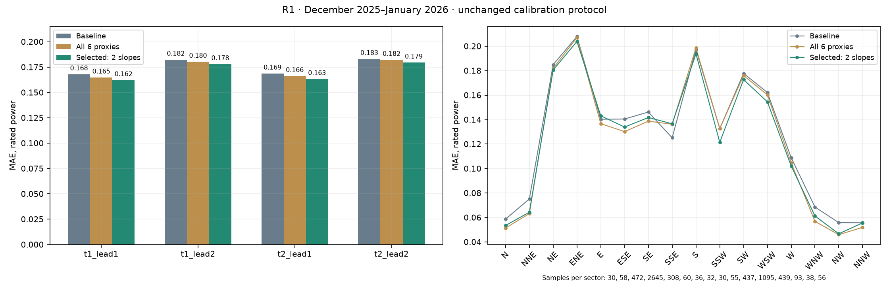
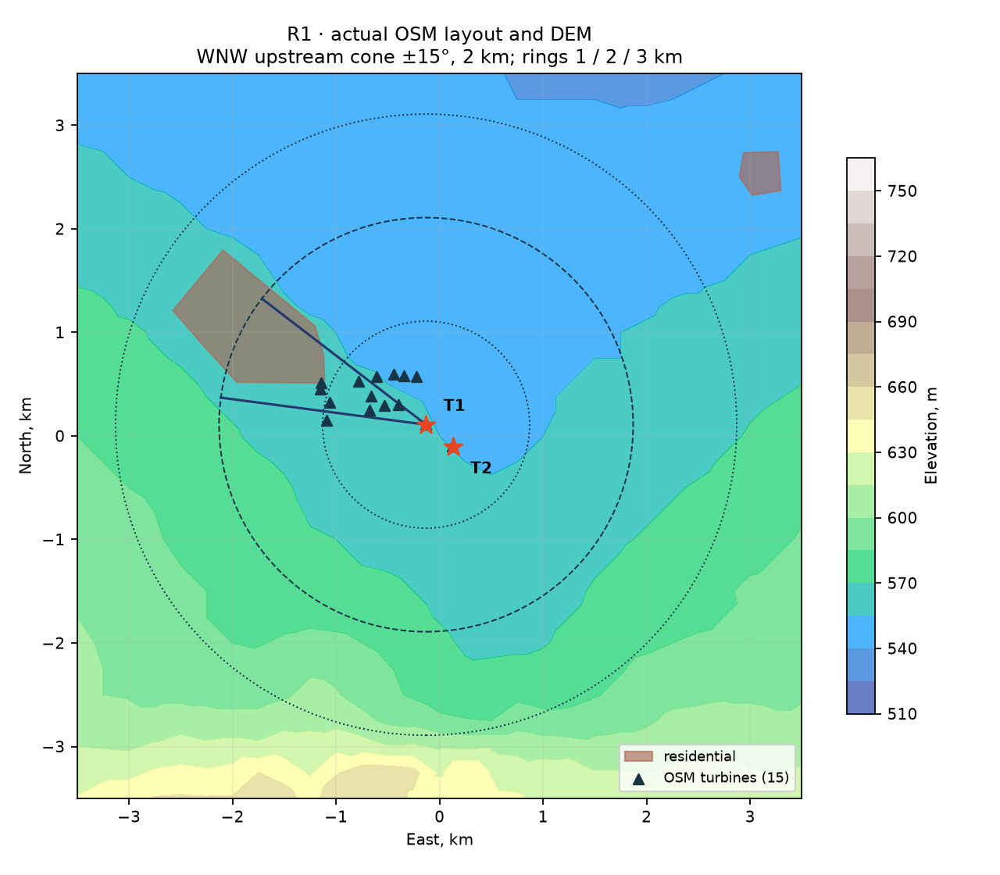
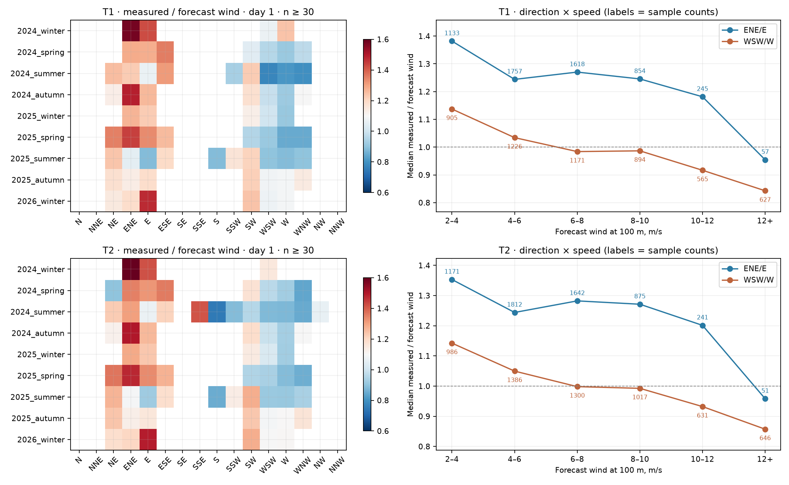

# R1 — направленные признаки рельефа, wake и землепользования

**Результат:** на фиксированном бэктесте MAE снижен на **2,73%**, RMSE — на **1,49%**. Все четыре группы «турбина × лаг» улучшились. Рассчитаны все три запрошенных вида геометрических признаков; в итоговый бустинг включены **два уклона рельефа**. Wake и шероховатость остаются доступны для диагностики и воспроизведения абляции: добавление их к уклонам уменьшает выигрыш. Механизм калибровки `PowerModel.calibrate` и материалы R2 не изменены.

База сравнения — `main` на коммите `37acdbd`. Одинаковые данные, признаки погоды, фильтры SCADA, параметры HGB, выпуск в 23:00 и `previous_day1/2`. Обучение до 30.11.2025, тест 01.12.2025–31.01.2026: 58 322 обучающих и 5 884 тестовых **строки**. Один физический час может входить для двух турбин и двух лагов.

## 1. Бэктест до/после

| Группа | Строк | MAE до → после | RMSE до → после | Снижение MAE | Покрытие P10–P90, % до → после |
|---|---:|---|---|---:|---|
| t1_lead1 | 1479 | 0.167879 → 0.162108 | 0.231100 → 0.225725 | +3.44% | 74.51 → 77.15 |
| t1_lead2 | 1479 | 0.182235 → 0.177850 | 0.249151 → 0.246896 | +2.41% | 74.31 → 77.01 |
| t2_lead1 | 1463 | 0.168596 → 0.163197 | 0.231819 → 0.226611 | +3.20% | 73.14 → 74.09 |
| t2_lead2 | 1463 | 0.183025 → 0.179419 | 0.250173 → 0.248385 | +1.97% | 72.39 → 73.27 |
| overall | 5884 | 0.175432 → 0.170640 | 0.240731 → 0.237145 | +2.73% | 73.59 → 75.39 |

Средняя ширина P10–P90: **0,43451 → 0,43617**; bias P50: **+0,04355 → +0,03434**. Полный набор из шести геометрических признаков тоже улучшает базу: MAE **0,173279** (−1,23%), RMSE **0,239025**, покрытие **74,18%**. Итоговый вариант с двумя уклонами лучше.



Источники: [сводка CSV](data/R1_comparison.csv), [база JSON](data/R1_baseline_metrics.json), [все признаки JSON](data/R1_all_metrics.json), [выбранная модель JSON](data/R1_selected_metrics.json). Почасовые CSV для всех трёх вариантов сохранены рядом.

## 2. Как выбран набор признаков

До просмотра основного теста сравнивались все восемь комбинаций трёх блоков: wake (2 признака), land (2), slope (2). Внутренние тесты: зима 12.2024–01.2025, 08–09.2025, 10–11.2025; обучение каждый раз строго раньше проверяемых месяцев. Ни коэффициенты `замер/прогноз`, ни факт мощности не входят в геометрические признаки.

В таблице — относительное снижение MAE; положительное значение лучше базы.

| Блоки | 12.2024–01.2025 | 08–09.2025 | 10–11.2025 | Среднее |
|---|---:|---:|---:|---:|
| baseline | +0.00% | +0.00% | +0.00% | +0.00% |
| wake | -1.82% | +0.62% | +1.89% | +0.23% |
| land | +0.45% | +0.59% | +2.14% | +1.06% |
| slope | +2.04% | +1.10% | +1.65% | +1.60% |
| wake+land | -0.89% | +0.16% | +0.65% | -0.03% |
| wake+slope | +0.86% | +0.97% | +1.07% | +0.97% |
| land+slope | -1.97% | +1.21% | +2.05% | +0.43% |
| wake+land+slope | +2.19% | +0.47% | +0.36% | +1.01% |

Уклоны имели лучший средний результат на ранних периодах. Основной тест затем использован для двух заранее объявленных сравнений: полного набора по заданию и лучшего раннего варианта. Параметры HGB, радиусы, ширины секторов и калибровка после этих результатов не подгонялись. [Все 24 проверки](data/R1_validation.json).

## 3. Геометрия и определения признаков

Используются сохранённые OSM и DEM, сеть при обучении и прогнозе не требуется. Проекция совпадает с существующей визуализацией: x — восток, y — север, метры. Направление — **откуда** приходит ветер.

| Признак | Расчёт | Итоговая модель |
|---|---|---|
| `wake_upwind_count` | Число соседних роторов до 2 км, угол к направлению прогноза ≤15°. Свой ротор исключается в пределах 20 м; другая из T1/T2 учитывается. | Только исследование |
| `wake_distance_weight` | Сумма `1/(1 + distance/500)` по тем же соседям; геометрический proxy. | Только исследование |
| `upwind_forest_fraction` | Доля площади леса в секторе 22,5°, кольцо 1–3 км, сетка центров ячеек 50 м. | Только исследование |
| `upwind_residential_fraction` | Аналогичная доля застройки; объединение полигонов без двойного счёта, с исключением отверстий. | Только исследование |
| `terrain_upwind_slope` | По DEM среднее `(высота площадки − высота точки)/расстояние` в наветренном секторе 22,5°, 1–3 км. | **Да** |
| `terrain_local_slope` | Плоскость `z=a*x+b*y+c` по DEM в радиусе 750 м; уклон вдоль прибывающего потока `−a*sin(dir)−b*cos(dir)`. | **Да** |

Уклоны безразмерны (м/м); положительный знак означает подъём по направлению потока к площадке. Высота площадки для первого признака — интерсепт локальной плоскости. Секторы центрированы на 0°, 22,5°, …, 337,5°; переход 359°↔0° циклический. Wake считается по **точному углу**, без округления до сектора.

DEM: 49×49 точек, шаг 250 м, ±6 км; источник — Copernicus DEM GLO-90 через Open-Meteo. Модуль `terrain.py` повторно использует геометрические соглашения и алгоритм склейки колец из `scripts/build_viz_data.py`, но не импортирует скрипт визуализации. Файлы читаются один раз за процесс. Отсутствующие/повреждённые OSM и DEM независимо дают нулевые признаки соответствующего типа. Для неизвестной турбины или отсутствующего направления геометрические признаки нулевые.



Карта: © участники OpenStreetMap (ODbL); высоты Copernicus DEM GLO-90 через Open-Meteo, атрибуция исходных данных сохранена в `data/terrain/`.

OSM содержит **15 турбин, 2 полигона застройки, 0 полигонов леса**. Ближайшие OSM-роторы к T1/T2 находятся в 8,75/9,73 м и исключены как собственные. Нулевой лесной признак означает отсутствие картографических данных, а не отсутствие леса на местности. В секторе ЗСЗ застройка занимает около **50,5% / 47,3%** кольца 1–3 км для T1/T2.

При ветре из центра сектора **ЗЮЗ** (247,5°) в конусе ±15° соседних турбин нет; при **ЗСЗ** (292,5°) их **8 для каждой турбины**, при З — 3/1. Поэтому исходное объяснение всего дефицита при ЗЮЗ следом парка геометрически не подтверждено. [Все 16 секторов для обеих турбин](data/R1_sector_context.csv). Числа в таблице относятся к центрам секторов; на их краях wake-count может меняться.

Это признаки формы местности, а не расчёт скорости CFD/Jensen. При фиксированных координатах они преобразуют уже известное модели направление и номер турбины; выигрыш может объясняться более удобным для деревьев представлением. Причинный эффект рельефа по одному бэктесту не установлен. Раскладка OSM — срез сентября 2026; история ввода роторов для ранних периодов неизвестна. В итоговой модели используются только уклоны DEM.

## 4. Коэффициент замер/прогноз и устойчивость

Использован `training_frame` с теми же фильтрами качества. Для отношений исключён прогноз <2 м/с, чтобы деление на почти нулевой ветер не искажало коэффициенты. Все таблицы содержат число строк, медиану и квартили. Диагностика охватывает доступную историю 16.02.2024–31.01.2026 и не используется для обучения признаков. Годы и сезоны определяются в местном времени; зимний сезон относится к году января/февраля, т.е. декабрь 2024 входит в зиму 2025. Крайние зимы неполные.

Для горизонта 1 сутки, ВСВ/В против ЗЮЗ/З:

| Турбина | Медиана при прогнозе ≥2 м/с, восток / запад | Медиана при 6–10 м/с, восток / запад | Средняя мощность при 6–10 м/с, восток / запад |
|---|---|---|---|
| T1 | 1,251 / 0,950 | 1,259 / 0,985 | 0,669 / 0,468 |
| T2 | 1,260 / 0,968 | 1,278 / 0,997 | 0,663 / 0,467 |

При прогнозе ≥12 м/с разница мощности уменьшается, но не исчезает: T1 **0,944 / 0,869**, T2 **0,926 / 0,857**. С востока здесь лишь 57/51 строка, с запада 627/646; уверенного вывода об исчезновении wake при номинале нет.

**Постоянный множитель неустойчив.** В диапазоне 6–10 м/с для T1 восточный коэффициент по календарным годам: 2024 — **1,296**, 2025 — **1,241**, январь 2026 — **1,112**; западный — **0,989 / 0,978 / 1,081**. Летом 2025 восток даёт **0,895 / 0,900** для T1/T2, а запад **0,952 / 0,986** — соотношение даже меняет знак. Это не позволяет жёстко зашить коэффициент 1,25 для востока.



Численные таблицы: [16 секторов](data/R1_ratio_sector.csv), [сектор × скорость](data/R1_ratio_speed.csv), [по календарным годам](data/R1_ratio_year.csv), [по сезонам и годам](data/R1_ratio_season_year.csv), [полный куб сектор × скорость × сезон](data/R1_ratio_cube.csv), [восток/запад](data/R1_flow_comparison.csv). В них представлены **обе турбины и оба лага**. На тепловой карте скрыты ячейки с n<30.

## 5. Ошибка по всем направлениям

Обе турбины и оба лага вместе. Плюс в последнем столбце означает снижение MAE.

| Сектор | Строк | MAE до | MAE после | Снижение MAE |
|---|---:|---:|---:|---:|
| N | 30 | 0.05865 | 0.05343 | +8.90% |
| NNE | 58 | 0.07513 | 0.06434 | +14.35% |
| NE | 472 | 0.18492 | 0.18055 | +2.37% |
| ENE | 2645 | 0.20795 | 0.20391 | +1.95% |
| E | 308 | 0.14031 | 0.14311 | -1.99% |
| ESE | 60 | 0.14049 | 0.13393 | +4.67% |
| SE | 36 | 0.14617 | 0.14171 | +3.06% |
| SSE | 32 | 0.12514 | 0.13658 | -9.14% |
| S | 30 | 0.19723 | 0.19382 | +1.73% |
| SSW | 55 | 0.13263 | 0.12145 | +8.43% |
| SW | 437 | 0.17780 | 0.17270 | +2.87% |
| WSW | 1095 | 0.16216 | 0.15454 | +4.70% |
| W | 439 | 0.10889 | 0.10208 | +6.25% |
| WNW | 93 | 0.06853 | 0.06119 | +10.71% |
| NW | 38 | 0.05580 | 0.04669 | +16.33% |
| NNW | 56 | 0.05568 | 0.05557 | +0.20% |

Выигрыш не равномерен: в В (308 строк) MAE вырос на 1,99%, в ЮЮВ (32 строки) — на 9,14%. В доминирующих ВСВ и ЗЮЗ MAE снизился на 1,95% и 4,70%. Редкие сектора имеют мало наблюдений; сравнение не доказывает статистическую значимость улучшения в каждом из них. [Полная детализация MAE/RMSE/покрытия по турбине × лагу × сектору](data/R1_comparison_by_turbine_lead_sector.csv).

## 6. Калибровка, артефакты и проверка

`src/wind_agent/model.py` не менялся. Бэктест вызывает существующую калибровку на октябре–ноябре 2025, финальное обучение — на декабре 2025–январе 2026 по прежнему протоколу. В обновлённом `models/power_model.joblib` **33 признака**, обе ненулевые поправки сохранены: **0,0482766 / 0,0811224**. Покрытие 75,39% не достигает 80%; отдельное задание R2 здесь не пересматривается.

```bash
OMP_NUM_THREADS=2 OPENBLAS_NUM_THREADS=2 PYTHONPATH=src wind-agent backtest --offline
OMP_NUM_THREADS=2 OPENBLAS_NUM_THREADS=2 PYTHONPATH=src wind-agent train --offline
OMP_NUM_THREADS=2 OPENBLAS_NUM_THREADS=2 PYTHONPATH=src python scripts/research_r1_terrain.py --backtests --validation
PYTHONPATH=src python -m pytest -q
```

Исследовательский скрипт повторяет исходный, полный и выбранный бэктесты с неизменённым методом калибровки; пересоздаёт таблицы и три графика. Все 24 ранние проверки и три итоговых бэктеста воспроизведены. **39 тестов прошли**, включая 11 новых проверок геометрии, отверстий полигонов, независимых fallback OSM/DEM и перехода 359°↔0°. Дополнительно проверен прогноз на 10.02.2026: **144 строки**, точный `FORECAST_COLUMNS`, горизонты 1–48 ч, P10≤P50≤P90, диапазон [0,1], сохранённая калибровка после загрузки. При отсутствии обоих файлов OSM/DEM та же модель также выдала 144 конечных, упорядоченных прогноза. Файлы рабочего бэктеста побайтно совпали с независимым повтором исследовательского скрипта.

**Для интеграции:** PR обновляет модель и бэктест. Сохранённые февральские прогнозы, LLM-отчёты, визуализация, README и отчёт R3 отражают предыдущую модель; их следует обновить финальным прогоном после объединения пакетов. R2 не изменён. Новых зависимостей и сетевых запросов при прогнозировании нет.
