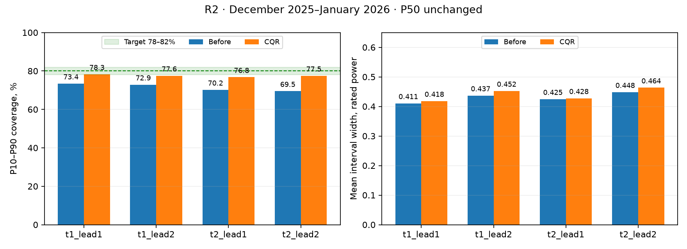

# R2 — калибровка интервалов P10–P90

**Статус: исследование завершено, критерий приёмки не достигнут.** CQR улучшает покрытие с **71,52% до 77,53%** (+6,02 п.п.), сохраняя P50 побитно. Требование 78–82% не выполнено ни в целом, ни в трёх из четырёх групп. Поэтому в этом PR нет изменений `src/`, `models/` и рабочих `outputs/`: прототип изолирован в `scripts/r2_candidate.py` и не включён в приложение.

## Сопоставимый бэктест

База: коммит `1c33f1e`, исходный бэктест воспроизведён точно. Обучающая история заканчивается 30.11.2025 23:00 UTC, тест — 01.12.2025–31.01.2026, 5 884 строки. Фильтры SCADA, признаки, погодный кэш и лаги не изменены. Мощность и ширина интервала — в долях номинала.

| Турбина / лаг | MAE до → после | RMSE до → после | Покрытие, % до → после | Средняя ширина до → после |
|---|---|---|---|---|
| t1 / 1–24 ч | 0,167879 → 0,167879 | 0,231100 → 0,231100 | 73,43 → 78,30 | 0,4105 → 0,4183 |
| t1 / 25–48 ч | 0,182235 → 0,182235 | 0,249151 → 0,249151 | 72,89 → 77,55 | 0,4369 → 0,4524 |
| t2 / 1–24 ч | 0,168596 → 0,168596 | 0,231819 → 0,231819 | 70,20 → 76,76 | 0,4248 → 0,4277 |
| t2 / 25–48 ч | 0,183025 → 0,183025 | 0,250173 → 0,250173 | 69,51 → 77,51 | 0,4484 → 0,4636 |
| Все | **0,175432 → 0,175432** | **0,240731 → 0,240731** | **71,52 → 77,53** | **0,4301 → 0,4405** |

Средняя ширина выросла на 0,01037 (+2,41%). Исходные значения: [сравнение JSON](data/R2_comparison.json), [почасовые прогнозы](data/R2_predictions.csv).



## Метод

Использован [Conformalized Quantile Regression, Romano et al.](https://arxiv.org/abs/1905.03222): score = max(P10 − факт, факт − P90); поправка — порядковая статистика ceil((n+1) × 0,8). Коррекция может быть отрицательной. После неё границы ограничиваются [0, 1] и расширяются до включения P50.

- 20% целых UTC-дней выбраны из обучающей истории с seed=42. Все часы, обе турбины и оба лага дня остаются вместе.
- Квантили обучены на 46 564 строках, калибровка — на 11 758 строках / 131 дне. Ни одна калибровочная метка мощности не входит в обучение квантилей.
- Поправки отдельные для каждого лага и диапазонов прогнозного ветра `<4`, `[4,8)`, `[8,12)`, `≥12` м/с. При менее 50 строках — fallback на лаг, затем общий.
- P50 обучается на всех 58 322 строках, как прежде. Он не участвует в вычислении калибровочных scores; включение P50 в готовый интервал может только расширить его.
- Прототип сохраняет поправки и даты калибровки внутри joblib и загружает старые модели без них. Финальная модель в `models/` не заменена, поскольку критерий приёмки не выполнен.

Это эмпирическая проверка на временном ряде, а не доказательство 80%-ной гарантии: зависимость часов, турбин и сезонный сдвиг нарушают стандартные предпосылки обменности. Калиброванные границы сохраняют имена P10/P90 для контракта, но CQR контролирует суммарное непокрытие; равные 10%-ные хвосты отдельно не гарантируются.

## Выбор варианта и отклонённые подходы

Проверены 16 комбинаций: последние 30/60/90 дней либо 20% целых дней; группировка по лагу, лагу×турбине, лагу×ветру, лагу×турбине×ветру. Три внутренних теста целиком предшествуют основному тесту. Выбранный вариант имел наименьшее среднее абсолютное отклонение покрытия от 80% по 12 группам: **1,865 п.п.** Его средняя ширина на этих периодах — 0,4703. Минимальная калибровочная группа выбранного варианта содержит 75 строк, поэтому fallback на внутренних тестах не применяется. Это не утверждение о глобально минимальной ширине.

| Внутренний тест | Покрытие выбранного варианта | Средняя ширина |
|---|---:|---:|
| 12.2024–01.2025 | 79,75% | 0,5057 |
| 08–09.2025 | 79,82% | 0,4397 |
| 10–11.2025 | 84,09% | 0,4654 |

[Все 48 внутренних проверок](data/R2_validation.json).

Хронологическое окно 90 дней с поправкой по лагу×турбине было первым кандидатом: на основном тесте **76,12%**, ширина **0,4668**. [Метрики первой попытки](data/R2_first_attempt.json).

Дополнительно проверен [иерархический conformal, Lee et al.](https://arxiv.org/abs/2306.06342): равный вес дня и дополнительная масса одного дня на бесконечности. На внутренних тестах покрытие 82,69% / 81,62% / 84,78%, интервалы шире; отклонение от 80% хуже. Этот вариант отклонён **до проверки на основном тесте**. [Результаты](data/R2_hierarchical_validation.json).

**Аудит выбора:** первый результат основного теста 76,12% был просмотрен до добавления зимнего внутреннего теста; второй — 77,53% — после выбора окончательного кандидата. После этого alpha, границы режимов и seed не подгонялись. Основной тест уже не является полностью нетронутым контрольным набором. Для будущего выбора нужна новая независимая проверка; факт февраля в проекте отсутствует.

## Воспроизведение и проверка

Из корня репозитория, с установленными зависимостями проекта:

```bash
OMP_NUM_THREADS=2 OPENBLAS_NUM_THREADS=2 PYTHONPATH=src python scripts/research_r2_calibration.py
OMP_NUM_THREADS=2 OPENBLAS_NUM_THREADS=2 PYTHONPATH=src python scripts/research_r2_calibration.py --validation
PYTHONPATH=src python -m pytest tests/test_calibration.py -q
```

Первая команда пересоздаёт сравнение и график, вторая также повторяет 48 проверок и 3 иерархических эксперимента. Всё работает офлайн. Семь тестов проверяют конечновыборочную поправку, режимы и fallback, сохранность P50, повторяющиеся индексы, разделение дней, сброс старой калибровки, сериализацию и совместимость со старым joblib.

**Рекомендация оркестратору:** принять исследовательский отчёт; не включать прототип в основной прогноз как готовое выполнение R2. Разница между хорошим покрытием осени и недостаточным покрытием зимы требует отдельной проверки сезонного переноса. Увеличение поправки по известному результату основного теста не является подтверждённым улучшением.
