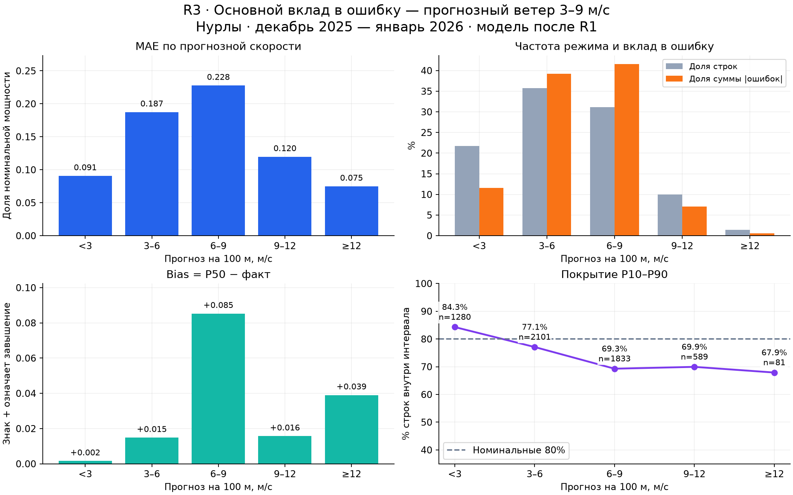
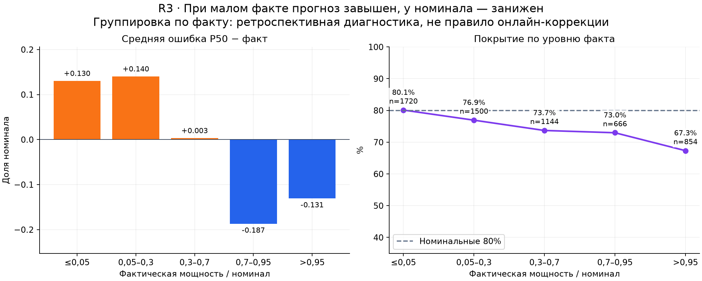
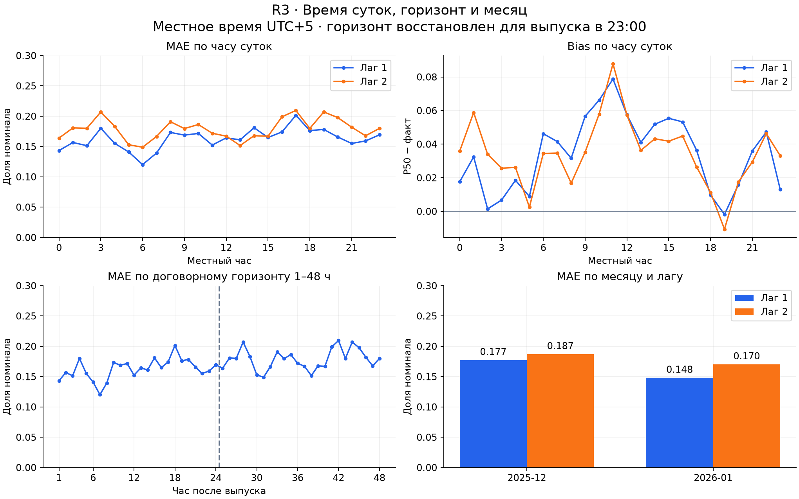
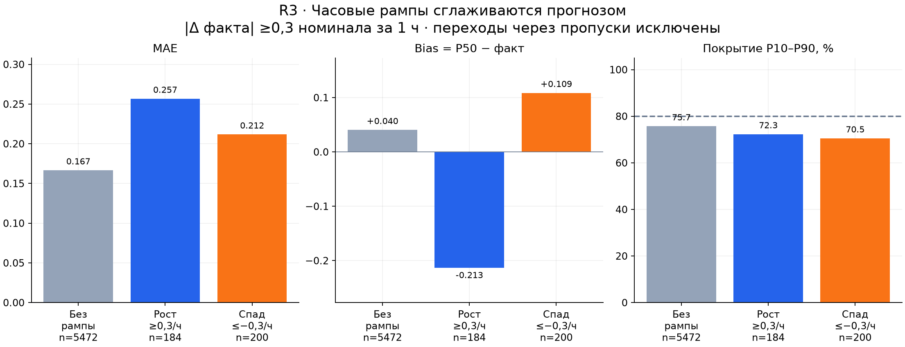
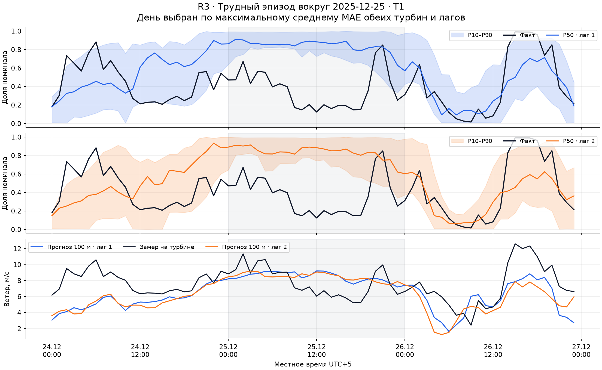

# R3 — где ошибается модель после R1

**Результат:** MAE **0.17064**, RMSE **0.23714**, bias **+0.03434**, покрытие P10–P90 **75.39%**. Анализирует сохранённый бэктест после R1; не переобучает модель и не меняет калибровку R2.

## 1. Данные и границы выводов

Источник: `outputs/backtest_predictions.csv`, проверен на совпадение агрегатов с `outputs/backtest_metrics.json`. Тест по прежнему протоколу 01.12.2025–31.01.2026, обучение до 30.11.2025, калибровка октябрь–ноябрь. Реальные крайние отметки теста: **01.12.2025 05:00 — 31.01.2026 23:00 UTC+5**. Погода для направления берётся офлайн из того же Previous Runs cache, по ключу время × турбина × лаг; соединение строго 1:1.

**5884 строк** — это 2942 различных «турбина × час» и 1479 различных временных отметок. Один и тот же факт повторяется для двух лагов. Это не 5884 независимых часов; соседние часы и турбины также связаны. Таблицы описательные, доверительные интервалы и статистическая значимость не заявляются. Уже исключены часы с недостатком SCADA и признаками простоя/ограничения по фильтру основного бэктеста: выводы не покрывают все эксплуатационные отказы и не распространяются на лето или другие ВЭС.

Ошибка — `P50 − факт`, единица — доля номинальной мощности. Положительный bias означает завышение. «Вклад» — доля суммы абсолютных ошибок, а не финансового ущерба. Прогнозный режим доступен до наступления часа; группы по факту, рампам и расхождению с замером — только ретроспективная диагностика.

| Турбина / лаг | Строк | Доля, % | MAE | RMSE | Bias | Покрытие, % | Вклад в абс. ошибку, % |
|---|---|---|---|---|---|---|---|
| t1 / 1 | 1479 | 25.1 | 0.1621 | 0.2257 | +0.0327 | 77.1 | 23.9 |
| t1 / 2 | 1479 | 25.1 | 0.1778 | 0.2469 | +0.0327 | 77.0 | 26.2 |
| t2 / 1 | 1463 | 24.9 | 0.1632 | 0.2266 | +0.0357 | 74.1 | 23.8 |
| t2 / 2 | 1463 | 24.9 | 0.1794 | 0.2484 | +0.0362 | 73.3 | 26.1 |

## 2. Ветер: где сосредоточена ошибка



| Прогноз 100 м, м/с | Строк | Доля, % | MAE | RMSE | Bias | Покрытие, % | Вклад в абс. ошибку, % |
|---|---|---|---|---|---|---|---|
| <3 | 1280 | 21.8 | 0.0907 | 0.1460 | +0.0016 | 84.3 | 11.6 |
| 3–6 | 2101 | 35.7 | 0.1874 | 0.2449 | +0.0149 | 77.1 | 39.2 |
| 6–9 | 1833 | 31.2 | 0.2278 | 0.2896 | +0.0853 | 69.3 | 41.6 |
| 9–12 | 589 | 10.0 | 0.1197 | 0.1922 | +0.0157 | 69.9 | 7.0 |
| ≥12 | 81 | 1.4 | 0.0749 | 0.1611 | +0.0390 | 67.9 | 0.6 |

Интервалы скорости **[0,3), [3,6), [6,9), [9,12), [12,+∞)**. Название «≥12» означает сильный прогнозный ветер, а не гарантированный номинал турбины. Диапазон **3–9 м/с** занимает **66.9%** строк и даёт **80.8%** суммы абсолютных ошибок. Максимальный MAE — в **6–9 м/с** (0.2278); это первый кандидат для дальнейших проверок качества прогноза.

При прогнозе <3 м/с bias **+0.0016**, MAE **0.0907**: утверждение «модель систематически занижает штиль» этими данными не подтверждается. Но слабый прогнозный ветер и низкая фактическая мощность — разные группы.

## 3. Смещение по факту и интервалы



| Фактическая мощность / номинал | Строк | Доля, % | MAE | RMSE | Bias | Покрытие, % | Вклад в абс. ошибку, % |
|---|---|---|---|---|---|---|---|
| ≤0,05 | 1720 | 29.2 | 0.1318 | 0.1979 | +0.1304 | 80.1 | 22.6 |
| 0,05–0,3 | 1500 | 25.5 | 0.1845 | 0.2533 | +0.1403 | 76.9 | 27.6 |
| 0,3–0,7 | 1144 | 19.4 | 0.2108 | 0.2523 | +0.0032 | 73.7 | 24.0 |
| 0,7–0,95 | 666 | 11.3 | 0.2162 | 0.2926 | -0.1871 | 73.0 | 14.3 |
| >0,95 | 854 | 14.5 | 0.1351 | 0.2095 | -0.1309 | 67.3 | 11.5 |

При факте ≤0,05 среднее завышение **+0.1304**, при факте >0,95 — занижение **-0.1309**. Такой рисунок совместим со сглаживанием экстремумов при неопределённом ветре и с условным отбором по самой целевой переменной. Он **не доказывает** ни неисправность, ни безошибочность модели. Нельзя автоматически вычитать эти bias в рабочем прогнозе: будущий факт неизвестен.

Покрытие в целом **75.39%** вместо номинальных 80%; факт ниже P10 в **14.16%**, выше P90 в **10.45%** строк. Средняя ширина **0.43618**. В группе факта >0,95 покрытие **67.3%**, поэтому прежнее утверждение о максимальном покрытии у потолка неверно. Покрытие для сильного прогнозного ветра ≥12 м/с — **67.9%**, но число строк здесь всего **81**. Калибровка не изменяется в R3; разрезы служат диагностикой.

## 4. Местный час, лаг и месяц



| Лаг, сутки | Строк | Доля, % | MAE | RMSE | Bias | Покрытие, % | Вклад в абс. ошибку, % |
|---|---|---|---|---|---|---|---|
| 1 | 2942 | 50.0 | 0.1626 | 0.2262 | +0.0342 | 75.6 | 47.7 |
| 2 | 2942 | 50.0 | 0.1786 | 0.2476 | +0.0344 | 75.2 | 52.3 |

| Месяц / лаг | Строк | Доля, % | MAE | RMSE | Bias | Покрытие, % | Вклад в абс. ошибку, % |
|---|---|---|---|---|---|---|---|
| 2025-12 / 1 | 1461 | 24.8 | 0.1774 | 0.2448 | +0.0142 | 74.1 | 25.8 |
| 2025-12 / 2 | 1461 | 24.8 | 0.1871 | 0.2548 | +0.0123 | 73.2 | 27.2 |
| 2026-01 / 1 | 1481 | 25.2 | 0.1481 | 0.2062 | +0.0540 | 77.1 | 21.8 |
| 2026-01 / 2 | 1481 | 25.2 | 0.1703 | 0.2404 | +0.0563 | 77.1 | 25.1 |

MAE второго лага выше первого на **9.8%**. В январе общий MAE ниже, чем в декабре (**0.1592 против 0.1822**), но положительный bias выше (**+0.0551 против +0.0133**). На объединённой выборке максимум по местному часу — **17:00** (0.2054), минимум — **06:00** (0.1345). Каждый час представлен примерно двумя месяцами, поэтому это не установленный суточный закон.

Горизонт восстановлен по договорному выпуску в 23:00: `h = 24*(lead_day−1) + local_hour + 1`. В пределах одного лага горизонт и местный час связаны однозначно: нельзя отделить влияние возраста прогноза от времени суток только этими графиками. Это не утверждение о точном возрасте исходного запуска NWP. Месячный разрез — по местной дате, границы основного теста сохранены. [Все 48 горизонтов](data/R3_horizon.csv), [24 часа × лаг](data/R3_hour_lead.csv), [месяц × ветер](data/R3_month_wind.csv).

## 5. Рампы: направление скачка имеет значение



Рампа — `|P(t)−P(t−1)| ≥ 0,3` при разнице меток **ровно один час**, отдельно для каждой турбины и лага. **28 строк** без предыдущего соседнего часа выделены как неизвестные, а не спокойные. Рамповых строк **384 из 5856** допустимых переходов (**6.56%**); факт повторяется между лагами. MAE при рампах **0.2333**, без рампы **0.1666**.

| Режим | Строк | Доля, % | MAE | RMSE | Bias | Покрытие, % | Вклад в абс. ошибку, % |
|---|---|---|---|---|---|---|---|
| Без рампы | 5472 | 93.0 | 0.1666 | 0.2340 | +0.0404 | 75.7 | 90.8 |
| Рост ≥0,3/ч | 184 | 3.1 | 0.2567 | 0.3019 | -0.2130 | 72.3 | 4.7 |
| Спад ≤−0,3/ч | 200 | 3.4 | 0.2117 | 0.2624 | +0.1086 | 70.5 | 4.2 |
| Нет предыдущего часа | 28 | 0.5 | 0.1074 | 0.1577 | -0.0501 | 71.4 | 0.3 |

При росте bias **-0.2130**, при спаде **+0.1086** — прогноз сглаживает переходы. Дополнительно проверено обнаружение скачков тем же порогом 0,3: сравнивается `ΔP50` с `Δфакта` и правильным знаком. Из этой проверки исключены смены суточного выпуска на местной полуночи и все пропуски.

| Лаг | Допустимых переходов | Рамп факта | Рамп P50 | Совпали порог и знак | Полнота, % | Точность, % |
|---|---:|---:|---:|---:|---:|---:|
| 1 | 2806 | 181 | 28 | 11 | 6.1 | 39.3 |
| 2 | 2806 | 181 | 28 | 8 | 4.4 | 28.6 |

Это строгая проверка совпадения **в тот же час**, без допуска ±1 ч; она не измеряет раннее предупреждение и не заменяет событийную оценку диспетчерской полезности.

## 6. Трудные эпизоды и возможные причины



Показан T1 вокруг **2025-12-25** — дня с максимальным средним MAE обеих турбин/лагов среди дней с ≥80 строками. Это намеренно трудный, выбранный постфактум эпизод, а не типичный день. Линии имеют разрывы там, где наблюдения исключены. P50 по одному лагу складывается из суточных выпусков; нижний график показывает прогноз best_match и замер на турбине.

| Местная дата | Строк | Доля, % | MAE | RMSE | Bias | Покрытие, % | Вклад в абс. ошибку, % |
|---|---|---|---|---|---|---|---|
| 2025-12-25 | 96 | 1.6 | 0.4744 | 0.5132 | +0.4709 | 10.4 | 4.5 |
| 2026-01-09 | 96 | 1.6 | 0.3658 | 0.4201 | +0.3658 | 37.5 | 3.5 |
| 2025-12-30 | 96 | 1.6 | 0.3241 | 0.3980 | -0.3241 | 39.6 | 3.1 |
| 2025-12-24 | 96 | 1.6 | 0.2990 | 0.3320 | +0.0666 | 74.0 | 2.9 |
| 2026-01-10 | 96 | 1.6 | 0.2802 | 0.2996 | +0.2798 | 46.9 | 2.7 |

На выбранном дне T1, лаг 1: средний факт **0.366**, средний P50 **0.845**. В час максимальной ошибки **25.12 12:00** факт **0.125**, P50 **0.883**, прогноз ветра **9.21 м/с**, замер **6.05 м/с**. Видимое расхождение ветра — возможный вклад, а не доказанная полная причина дефицита.

| Абс. расхождение ветра, м/с | Строк | Доля, % | MAE | RMSE | Bias | Покрытие, % | Вклад в абс. ошибку, % |
|---|---|---|---|---|---|---|---|
| <1 | 1601 | 27.2 | 0.1461 | 0.1970 | +0.1287 | 82.8 | 23.3 |
| 1–2 | 1434 | 24.4 | 0.1363 | 0.1927 | +0.0836 | 84.9 | 19.5 |
| 2–4 | 1929 | 32.8 | 0.1578 | 0.2226 | +0.0064 | 77.2 | 30.3 |
| ≥4 | 920 | 15.6 | 0.2937 | 0.3611 | -0.1480 | 43.9 | 26.9 |

Корреляция ошибки мощности с `прогноз ветра 100 м − замер на турбине` равна **+0.725**. Это совместимо с вкладом несоответствия ветра в ошибки мощности. Но замер и прогноз относятся к разным пространственным масштабам/высотам, а модель использует ещё ансамбль, направление и рельеф: корреляция не устанавливает единственную причину. Без журналов состояния оборудования нельзя отделить оставшиеся ограничения, ошибки SCADA и аэродинамику. Не приписываем ошибку конкретной аварии или следу турбин.

## 7. Что вынести на Demo Day

- **Сосредоточить улучшения на 3–9 м/с:** 66.9% строк дают 80.8% абсолютной ошибки. Проверять прогноз ветра и режимные поправки на новых временных holdout, не подгонять на этом тесте.
- **Переходы — отдельная задача:** при росте модель недодаёт, при падении завышает мощность. Нужны события, знак и время рампы, а не только общий MAE.
- **Не обещать 80% фактического покрытия:** здесь 75.39%; показывать ограничения по режимам рядом с вероятностным прогнозом. Изменение калибровки — отдельная работа.
- **Не обобщать зимний бэктест на весь год:** отдельно проверять другие сезоны, оборудование и режимы ограничений; разрез по факту использовать для диагностики, а не как доступный модели признак.

## 8. Воспроизведение и проверка

```bash
PYTHONPATH=src python scripts/make_error_analysis.py
PYTHONPATH=src python -m pytest -q tests/test_error_analysis.py
```

Скрипт использует только сохранённые прогнозы и локальный погодный кэш; модель и исходные файлы бэктеста не записывает. Генерирует этот отчёт, **пять PNG** в `outputs/figures/`, таблицы `docs/research/data/R3_*.csv` и [manifest](data/R3_manifest.json) с SHA-256 входов. Проверяет ключи, временную стыковку, конечность и порядок квантилей, совпадение итоговых метрик с JSON и суммы строк в разрезах. Результаты в таблицах — полный пересчёт после R1; R2 и код ядра не менялись.

Дополнительно: [сектора направления](data/R3_sector.csv), [рампы по лагам](data/R3_ramps_lead.csv), [20 крупнейших ошибок](data/R3_largest_errors.csv). В CSV также есть RMSE, ширина, доли выходов ниже/выше интервала и 90-й перцентиль абсолютной ошибки. Столбец «Доля» рассчитан от всех 5884 строк, «Вклад» — от общей суммы абсолютных ошибок. Покрытие и доли выходов за интервал рассчитаны внутри каждой группы; знаменатели полноты/точности обнаружения рамп приведены в её таблице.
