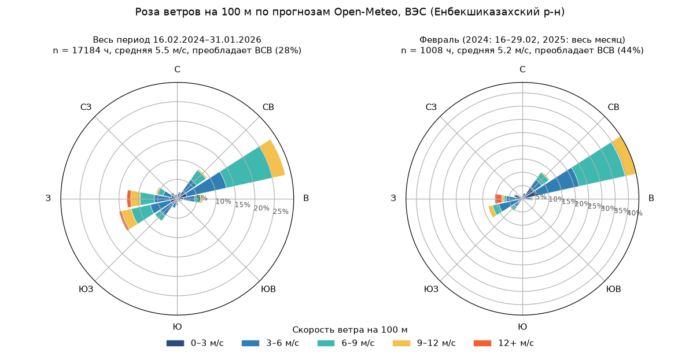
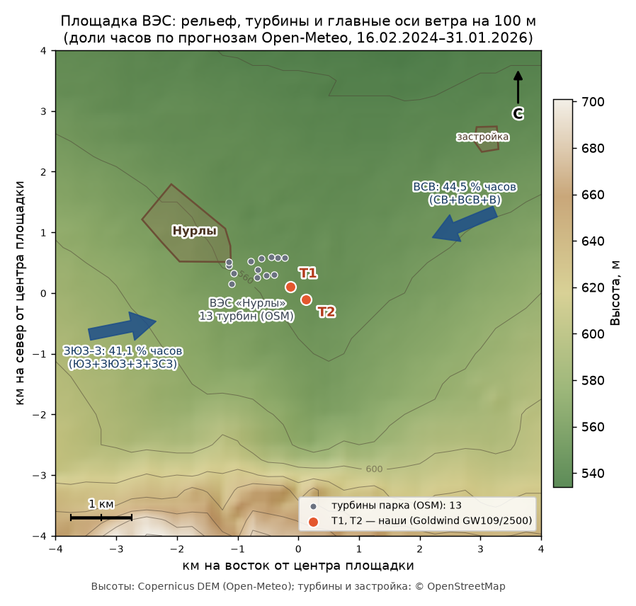

# 3D-визуализация: поле ветра над рельефом ВЭС

Одна страница (`viz/index.html`, three.js с CDN, без сборки) показывает прогнозное поле ветра Open-Meteo
на 100 м над рельефом вокруг двух турбин и связывает его с почасовым прогнозом выработки парка на 48 часов.

> Это визуализация прогнозного поля ветра, **а не CFD-симуляция**. Направление и скорость ветра
> берутся из одного прогноза Open-Meteo для площадки ВЭС и одинаковы по всему квадрату 12 × 12 км.
> Обтекание рельефа, турбулентность и аэродинамические следы турбин не моделируются.






## Что на странице

- **3D-рельеф**: сетка высот 49 × 49 с шагом 250 м (квадрат ±6 км от середины между T1 и T2), окраска по высоте,
  вертикальный масштаб ×1–5 (по умолчанию ×3).
- **Турбины T1 и T2**: ротор разворачивается навстречу прогнозному ветру, скорость вращения пропорциональна P50 турбины.
  Турбины увеличены и масштабируются вместе с вертикалью, поэтому ступица всегда на уровне слоя частиц.
- **Частицы ветра** (2–4 тыс.): летят ~100 м над поверхностью по направлению `wind_direction_100m`, скорость
  пропорциональна `wind_speed_100m` (ускорено ×120). Цвет показывает `temperature_2m` от синего к красному,
  с поправкой на высоту рельефа −6,5 °C/км. Небольшой шум направления добавлен только ради читаемости картинки.
- **Панель**: выбор даты выпуска, слайдер и автовоспроизведение по 48 часам, текущий час (UTC+5), ветер, порывы,
  направление, температура, мощность парка P10/P50/P90 и P50 по T1/T2, график P50 на 48 ч (клик по графику
  переходит к этому часу), роза ветров «весь период / февраль» со стрелкой прогноза текущего часа.
- **Контекст из OpenStreetMap**: 13 турбин парка «Нурлы» (серые; наши T1/T2 выделены и подписаны, в OSM это
  Goldwind GW109/2500 — совпадение координат ≈ 9–10 м), застройка (посёлок Нурлы к западу-северо-западу).
  Полигонов леса (`landuse=forest`, `natural=wood`) в радиусе 5 км в OSM нет, поэтому лес не рисуется.
- **Наветренный сектор**: в панели «Прогноз на этот час» строка «Сектор: … — наветренная сторона свободна / турбины
  парка с наветренной стороны». Считается число турбин в конусе ±15° навстречу прогнозному ветру до 2 км от T1 и T2.
  Тот же конус виден на рельефе: бирюзовый — сектор свободен, жёлтый — в нём есть турбины (при западном ветре
  у T1 их до 4, ближайшая в ~570 м).
- Клавиши: пробел запускает и останавливает воспроизведение, ← → листают часы.

## Сборка данных

```bash
.venv/bin/python scripts/fetch_dem.py          # рельеф → data/terrain/dem_grid.csv + meta.json (≈5 мин, один раз)
.venv/bin/python scripts/fetch_osm_context.py  # OSM → data/terrain/osm_context.json (турбины, лес, застройка; один раз)
.venv/bin/python scripts/build_viz_data.py     # → viz/data/viz_data.js и viz/wind_rose.png
.venv/bin/python scripts/build_viz_data.py --sample   # принудительно ОБРАЗЕЦ прогнозов (модель + офлайн-кэш)
.venv/bin/python scripts/make_site_map.py      # статичные карты viz/site_map.png и viz/site_map_wake.png (dpi 130)
```

- `fetch_dem.py` берёт высоты из Open-Meteo Elevation API (Copernicus DEM GLO-90) пачками по 100 точек.
  Бесплатный лимит считает каждую точку отдельным вызовом (~600 в минуту), поэтому между запросами пауза 11 с.
  Скрипт идемпотентный: если файлы есть, он ничего не качает (`--force` перекачивает), а после обрыва
  продолжает с того места, где остановился.
- `build_viz_data.py` читает `outputs/forecasts/YYYY-MM-DD.csv` (сводные файлы вроде `latest_by_target.csv`
  пропускает). Если прогнозов нет или указан `--sample`, он генерирует образец в том же контракте колонок
  за 31.01–27.02.2026 (`--sample-dates 2026-02-10,2026-02-11` сужает список) и кладёт CSV в
  `viz/data/sample_forecasts/`. На странице образец помечается оранжевым бейджем.
- Роза ветров строится по архиву прогнозов `data/cache/openmeteo/prevruns__t1__2024-02-16__2026-01-31.csv`
  (колонки без `_previous_dayN`): 16 румбов × скорость 0–3, 3–6, 6–9, 9–12, 12+ м/с, в процентах от всех часов,
  плюс средняя скорость по румбам. Февраль — это 16–29.02.2024 и весь февраль 2025 (1008 часов).
- `fetch_osm_context.py` делает один запрос к Overpass API (`out geom`, радиус 5 км, таймаут 90 с, 3 попытки)
  и сохраняет ответ как есть. Если Overpass недоступен, скрипт завершается с понятной ошибкой (код 1),
  а сборка и страница работают без слоёв OSM.
- Если DEM ещё не скачан, сборка всё равно проходит: рельеф будет плоским, в консоли появится предупреждение.

Мощность везде указана в процентах от номинала. Парк — строки `turbine = farm`, а если их нет, среднее по T1 и T2.

## Как открыть

- Дважды щёлкните `viz/index.html`: данные подключаются обычным `<script src="data/viz_data.js">`, поэтому
  страница работает по `file://` без сервера. Для three.js с cdn.jsdelivr.net нужен интернет.
- Или запустите локальный сервер: `.venv/bin/python -m http.server 8765 --directory viz` и откройте http://localhost:8765.

## Файлы

| Файл | Что это |
|---|---|
| `scripts/fetch_dem.py` | загрузка сетки высот |
| `scripts/build_viz_data.py` | сборка `viz/data/viz_data.js` и `viz/wind_rose.png` |
| `scripts/fetch_osm_context.py` | выгрузка турбин, леса и застройки из OSM (Overpass API) |
| `data/terrain/dem_grid.csv`, `meta.json` | рельеф: lat, lon, elevation_m, индексы i/j, локальные x/y в метрах |
| `data/terrain/osm_context.json` | ответ Overpass (© участники OpenStreetMap, ODbL) |
| `viz/index.html` | страница (three.js 0.160 + OrbitControls через importmap) |
| `viz/data/viz_data.js` | `window.VIZ_DATA = {terrain, turbines, wind_rose, forecasts, …}`, ≈0,4 МБ |
| `viz/data/sample_forecasts/*.csv` | образец прогнозов в контракте `outputs/forecasts` (появляется только в режиме образца) |
| `viz/wind_rose.png` | роза ветров для README (matplotlib) |
